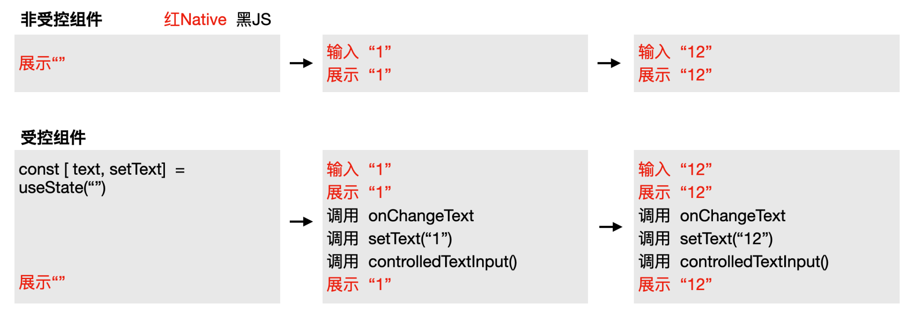
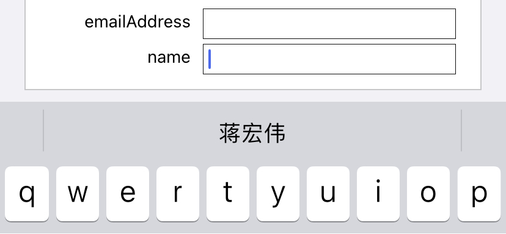
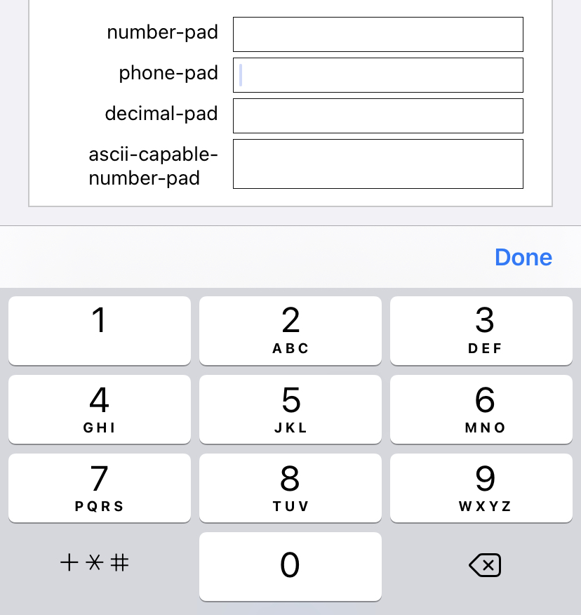
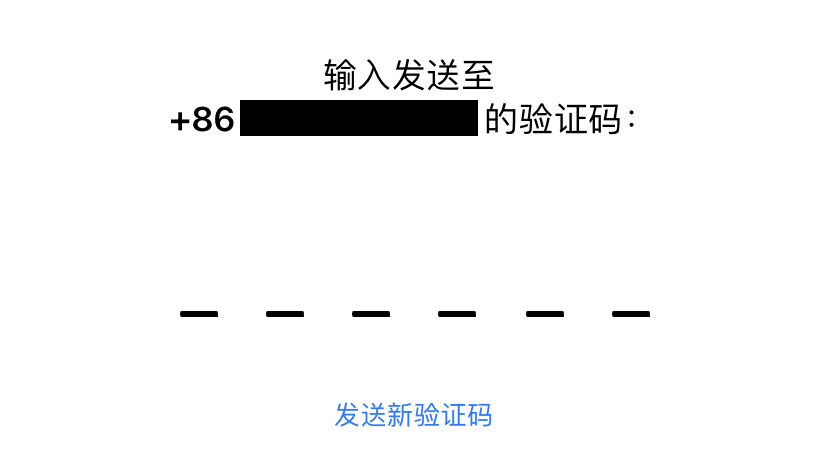

# 07｜TextInput：如何实现一个体验好的输入框？
你好，我是蒋宏伟。

上一讲，我们介绍了如何去打磨点按组件的体验细节，这一讲我们就开始介绍如何打磨一个文本输入组件 TextInput 的体验细节。

作为一个优秀工程师，要想优化页面的用户体验，只知道打磨点按组件是远远不够的，而且，相对于点按组件组件来说，要把文本输入组件 TextInput 的细节体验弄好，要更难一些。

这个难点主要有两方面。首先，TextInput 组件是自带状态的宿主组件。TextInput 输入框中的文字状态、光标状态、焦点状态在 React Native 的 JavaScript 框架层的框架层有一份，在 Native 的还有一份，有时候业务代码中还有一份。那多份状态到底以谁为主呢？这件事我们得搞清楚。

其次，TextInput 组件和键盘是联动的，在处理好 TextInput 组件的同时，我们还得关心一下键盘。当然键盘本身是有 `Keyboard` API 的，但是键盘类型是“普通键盘”还是“纯数字键盘”，或者键盘右下角的按钮文字是“确定”还是“搜索”，都是由 TextInput 组件控制的。

这一讲，我将以如何实现一个体验好的输入框为线索，和你介绍使用 TextInput 组件应该知道的三件事。

## 输入框的文字

第一件事，你得知道如何处理输入框的文字。

关于如何处理输入框的文字，网上有两种说法。有些人倾向于使用非受控组件来处理，他们认为“不应该使用 useState 去控制 TextInput 的文字状态”，因为 ref 方案更加简单；有些人倾向于使用受控组件来处理，这些人认为“直接使用 ref 去操作宿主组件这太黑科技了”。这两种说法是相互矛盾的，究竟哪种是正确的呢？

我们先从最简单的 **非受控（Uncontrolled）组件** 说起。

非受控的意思就是不使用 state，直接对从宿主组件上将文本的值同步到 JavaScript。一个非受控的 UncontrolledTextInput 组件示例如下：

```plain
const UncontrolledTextInput = () => <TextInput />

```

只要这一行代码，用户就可以输入文字了。在 UncontrolledTextInput 组件中， TextInput 元素是不受 state 控制，但在 JavaScript 代码中却并不知道用户输入的是什么，因此还要一个变量来存储用户输入的值。

用什么变量呢？首先在组件中声明局部变量是不行的，我们知道 render 就是组件函数的执行，每次执行局部变量也会重新赋值，局部变量保存的值不能跨越两次 render。其次，用全局变量或文件作用域的变量也是不行的，组件销毁时这些全局变量是不会销毁的，有内存泄露的风险。再者，用 state 也是不行的，用了 state 就成了受控组件了。

对于非受控组件来说，存储跨域两次 render 的可行方案是 ref。 **ref 的值不会因为组件刷新而重新声明，它是专门用来存储组件级别的信息的。** [React 官方推荐](https://beta.reactjs.org/learn/referencing-values-with-refs#when-to-use-refs) 有三种场景我们可以用它：

- 存储 setTimeout/setInterval 的 ID；
- 存储和操作宿主组件（在 Web 中是 DOM 元素）；
- 存储其他不会参与 JSX 计算的对象。

我们使用 ref 保存非受控输入框的值，就属于第三种场景，示例代码如下：

```plain
function UncontrolledTextInput2() {
  const textRef = React.useRef('');
  return <TextInput onChangeText={text => textRef.current = text}/>
}

```

你看，首先我们使用 `useRef` 创建了一个用于保存用户输入的文字的对象 `textRef`。每当用户输入文字的时候，会触发 TextInput 的 `onChangeText` 事件，在该事件的回调中，我们将最新的 `text` 赋值给了 `textRef.current` 进行保存。这时，每次获取文字就都是最新的文字了。

非受控组件的原理是最简单的，用户输入的“文本原件”是存在宿主组件上的，JavaScript 中的只是用 `textRef` 复制了一份 “文本的副本”而已。

但正是因为非受控组件使用的是副本，一些复杂的操作是做不了的，比如将用户输入的字母由大写强制改为小写，等等。在新架构 Fabric 之前，React Native 还提供了直接修改宿主组件属性的 `setNativeProps` 方法，但是 Fabric 之后（包括 Fabric 预览版）， `setNativeProps` 就不能用了。

因此我们要操作文本原件，必须得用 **受控（Controlled）组件**。

受控的意思说的是使用 JavaScript 中的 state 去控制宿主组件中的值。一个受控的 ControlledTextInput 组件示例如下：

```plain
function ControlledTextInput() {
  const [text, setText] = React.useState('');
  return  <TextInput value={text} onChangeText={setText} />
}

```

在这个示例中，我们先使用了 `useState` 创建了一个状态 `text` 和状态更新函数 `setText`，并将状态 `text` 赋值给了 TextInput 的属性 `value`， `value` 是控制 TextInput 宿主组件展示的值用的。在用户输入文字后，会触发 onChangeText 事件，这时就会调用 `setText`，将状态 `text` 更新为用户最新输入的值。

那受控组件和非受控组件有什么区别呢？我把它们之间的实现原理画了一张图：



你看，对于非受控组件来说，用户输入文字和文字展示到屏幕的过程，全部都是在宿主应用层面进行的，JavaScript 业务代码是没有参与的。

然而，对于受控组件来说，用户输入文字和文字展示这两步，依旧是在宿主应用层面进行的。但后续 JavaScript 业务代码也参与进去了，业务代码依次执行了 onChangeText 函数、setText 函数、controlledTextInput 函数，并且再次更新了展示值。

也就是说，受控组件更新了两次展示的值，只是因为两次展示的值是一样的，用户看不出来而已。对于受控组件而言，即便存在系统或 Native 修改文本的情况，在 TextInput 的底层，也会将其强制更新为当前 TextInput 的 value 属性值。所以对于受控组件来说，输入框的文字始终是由 state 驱动的。

更新两次的好处在于，可以更加自由地控制输入的文本，比如语音输入文字、通过地图定位填写详细地址。这些复杂场景下，用户既可以自由输入文字，也可以引入程序参与进来。而非受控组件只适用于用户自由输入的场景。

不过，你可能会对更新两次有性能上的担忧。我也写了两个极限情况下的 demo，模拟了文字改变事件中需要处理 1s 任务，并且分别试了 onChangeText 的异步更新，和新架构提供的 unstable\_onChangeSync 同步更新：

```plain
<TextInput
  onChangeText={text => {
    const time = Date.now();
    while (Date.now() - time <= 1000) {}
    setText(text);
  }}
/>
<TextInput
  unstable_onChangeSync={event => {
    const text = event.nativeEvent.text;
    const time = Date.now();
    while (Date.now() - time <= 1000) {}
    setText(text);
  }}
/>

```

异步更新情况下，JavaScript 线程和 UI 主线程是独立运行的，此时即便 JavaScript 线程卡了 1s，主线程依旧可以正常输入文字。但同步更新的情况下，从输入文字到展示文字会有 1s 的延迟， JavaScript 线程有 1s 的阻塞，UI 主线程也会卡死 1s。

当然，大多数情况下处理文字改变事件肯定用不了 1s，甚至用不了 1ms。模拟极限情况，只是为了说明新架构的同步和异步是可选的，如果你担心性能问题，用异步就好了。

现在如果要我给个处理输入框的文本建议，那我的建议就是 **使用受控组件，并且使用异步的文字改变事件**，这也符合大部分人的代码习惯。

## 输入框的焦点

你需要关注的第二件事是，如何控制输入框的焦点。通常光标放置在哪个输入框上，那个输入框就是页面的唯一焦点。

有些场景下，输入框的焦点是程序自动控制的，无需开发者处理。比如用户点击手机屏幕上的输入框，此时焦点和光标都会移到输入框上。

有些场景下，是需要代码介入控制焦点的。比如你购物搜索商品，从首页跳到搜索页时，搜索页的焦点就是用代码控制的。或者你在填写收货地址时，为了让你少点几次输入框，当你按下键盘的下一项按钮时，焦点就会从当前输入框自动转移到下一个输入框。

我们先来看怎么实现自动“对焦”，以搜索页的搜索输入框自动对焦为例，示例代码如下：

```plain
<TextInput autoFocus/>

```

TextInput 的 autoFocus 属性，就是用于控制自动对焦用的，其默认值是 false。也就是说，所有的 TextInput 元素默认都不会自动的对焦，而我们将 TextInput 的 autoFocus 属性设置为 true 时，框架会在 TextInput 元素挂载后，自动帮我们进行对焦。

搜索页面只有一个搜索框的场景下 ，autoFocus 是好用的。但当一个页面有多个输入框时，autoFocus 就没法实现焦点的转移了。

比如，在购物 App 中填写收货地址时，你每完成一项填写，点击键盘中的下一项按钮，焦点就会自动转移一次，从姓名到电话再到地址。我们以前讲过，React/React Native 是声明式的，但是在操作自带状态的宿主属性时，比如焦点转移，声明式就不管用了，还得用给宿主组件下命令。

那怎么下命令呢？我们先从最简单的控制 TextInput 焦点讲起，示例代码如下：

```plain
function AutoNextFocusTextInputs() {
  const ref1 = React.useRef<TextInput>(null);

  useEffect(()=>{
    ref1.current?.focus()
  },[])

  return  (
    <TextInput ref={ref1}  />
    )
}

```

在这段代码中，先声明了一个 `ref1` 用于保存 TextInput 宿主组件。在该宿主组件上封装了 Native/C++ 层暴露给 JavaScript 的命令，比如对焦 `focus()`、失焦 `blur()`、控制选中文字的光标 `setSelection`。

`AutoNextFocusTextInputs` 组件在挂载完成后，程序会调用 `ref1.current.focus()`，将焦点对到 TextInput 元素上，这就是使用 `focus()` 实现对焦的原理。

使用 `focus()` 命令对焦和使用 `autoFocus` 属性对焦，在原生应用层面的实现原理是一样的，只不过在 JavaScript 层面，前者是命令式的，后者是声明式的。对自带状态的宿主组件而言，命令式的方法能够进行更复杂的操作。

那要实现每点一次键盘的“下一项”按钮，将焦点对到下一个 TextInput 元素上，怎么实现呢？具体的示例代码如下：

```plain
function AutoNextFocusTextInputs() {
  const ref1 = React.useRef<TextInput>(null);
  const ref2 = React.useRef<TextInput>(null);
  const ref3 = React.useRef<TextInput>(null);

  return (
    <>
      <TextInput ref={ref1} onSubmitEditing={ref2.current?.focus} /> // 姓名输入框
      <TextInput ref={ref2} onSubmitEditing={ref3.current?.focus} /> // 电话输入框
      <TextInput ref={ref3} /> // 地址输入框
    </>
  );
}

```

首先，我们得声明 3 个 `ref` 用于保存 3 个 TextInput 元素。其次，实现这三个元素，它们依次是姓名输入框、电话输入框、地址输入框。最后，需要监听点击键盘完成按钮的提交事件 `onSubmitEditing`，在 `onSubmitEditing` 的回调中，将焦点通过 `ref.focus()` 转移到下一个 TextInput 元素上。

这里再多说一句，为了简单起见，我们把三个 TextInput 元素都封装到了同一个组件中。在真实的项目中，这三个输入框往往不是封装成同一个组件中的，姓名输入框、电话输入框、地址输入框每个都是一个独立的组件，然后再有一个大的复合组件将它们组合在一起的。

那么这时，如何获取到 TextInput 元素 `ref` 呢？如果你遇到了这个问题，你可以查一下 [React 文档](https://zh-hans.reactjs.org/docs/forwarding-refs.html) 中，关于使用 `React.forwardRef` 转发 `ref` 的具体用法，这里我就不展开了。

## 联动键盘的体验

你需要关注的第三件事是，输入键盘的体验细节。

我们前面提到过，输入框和键盘是联动的，键盘的很多属性都可以用 TextInput 组件来设置。因此，除了输入框的值、输入框的焦点，我们还需要关心如何控制键盘。我们一起来看看那些优秀的 App 都是怎么处理这个细节的。

先来看第一个体验细节，iOS 微信搜索框的键盘右下角按钮有一个 **“置灰置蓝”** 的功能。默认情况下，键盘右下角的按钮显示的是置灰的“搜索”二字，当你在搜索框输入文字后，置灰的“搜索”按钮会变成蓝色背景的“搜索”二字。

置灰的作用是提示用户，没有输入文字不能进行搜索，按钮变蓝提示的是有内容了，可以搜索了。

控制键盘右下角按钮置灰置蓝的，是 TextInput 的 `enablesReturnKeyAutomatically` 属性，这个属性是 iOS 独有的属性，默认是 `false`，也就是任何使用键盘右下角的按钮，都可以点击。你也可以通过将其设置为 `true`，使其在输入框中没有文字时置灰。


第二个体验细节是，键盘右下角按钮的文案是可以变化的，你可以根据不同的业务场景进行设置。

有两个属性可以设置这些文案，包括 iOS/Android 通用的 [returnKeyType](https://reactnative.dev/docs/next/textinput#returnkeytype) 和 Android 独有的 [returnKeyLabel](https://reactnative.dev/docs/next/textinput#returnkeylabel-android)。全部的属性你可以查一下文档，我这里只说一下通用属性：

- `default`：显示的文案是换行；
- `done`：显示的文案是“完成”，它适合作为最后一个输入框的提示文案；
- `go`：显示的文案是“前往”，它适合作为浏览器网站输入框或页面跳出的提示文案；
- `next`：显示的文案是“下一项”，它适合作为转移焦点的提示文案；
- `search`：显示的文案是“搜索”，它适合作为搜索框的提示文案；
- `send`：显示的文案是“发送”，它比较适合聊天输入框的提示文案。


比如，在用户填写收货地址表单的场景中，你可以在用户完成填写时，将键盘按钮文案设置成“下一项”，并在用户点击“下一项”时，把当前输入框的焦点聚焦到一下个输入框上。

第三个体验细节是，登录页面的自动填写账号密码功能。虽然现在有了二维码登录，但传统的账号密码登录场景还是非常多的。每次登录的时候，要输入一遍账号密码，就很麻烦了。

无论是 iOS 还是 Android，它们都有系统层面的记住账号密码的功能，帮助用户快速完成账号密码的填写。完成快速填写功能的 TextInput 属性，在 iOS 上叫做 `textContentType`，在 Android 上叫做 `autoComplete`。

你可以将账号输入框的快速填写属性设置为 `username`，将密码输入框的快速填写属性设置为 `password`，帮助用户节约一些时间，提高一下整体的成功率。除此之外，一些姓名、电话、地址信息也可以快速填写。



还有一些键盘的体验细节，比如 `keyboardType` 可以控制键盘类型，可以让用户更方便地输入电话号码 `phone-pad`、邮箱地址 `email-address` 等等。



当你知道这些键盘细节后，你就可以利用这些系统的特性，帮你的 App 体验变得更好。现在，我们回过头，再来改善一下，我们之前实现的自动聚焦组件 `AutoNextFocusTextInputs` 吧。示例代码如下：

```plain
function AutoNextFocusTextInputs() {
  const ref1,ref2,ref3 ...

  return (
    <>
      <TextInput ref={ref1} placeholder="姓名" textContentType="name" returnKeyType="next" onSubmitEditing={ref2.current?.focus}/>
      <TextInput ref={ref2} placeholder="电话"  keyboardType="phone-pad" returnKeyType="done" onSubmitEditing={ref3.current?.focus}
      />
      <TextInput  ref={ref3}  placeholder="地址"  returnKeyType="done" />
    </>
  );
}

```

在这段代码中，我们使用了 `placeholder` 来提醒用户该输入框应该输入什么，使用了 `textContentType="name"` 来辅助用户填写姓名，使用了 `keyboardType="phone-pad"` 来指定键盘只用于输入电话号码，使用 `returnKeyType="next" 或 "done"` 来提示用户当前操作的含义，当然还有 `ref.current.focus()` 的自动聚焦功能。

## 总结

这一讲，我们还是围绕着交互体验这个角度来讲组件，从交互体验这个角度看 TextInput 组件，我们需要注意三件事：

1. 学会处理输入框的文字。有两种处理方式受控组件和非受控组件，受控组件更强大一些，也更符合大多数 React/React Native 开发者的习惯；
2. 学会处理输入框的焦点。处理焦点有两种方式：一种是声明式的 `autoFocus` 属性，另一种是命令式的 `ref.current.focus()` 方法，前者适用场景有限，后者适用场景更多；
3. 学会处理与输入框联动的键盘，包括键盘右下角的按钮、键盘提示文案、键盘类型等等。

日常工作中，用到 TextInput 输入框的场景非常多，有聊天框、搜索框、信息表单等等，相信学完这一讲后，你能更好地处理 TextInput 体验细节。

## 附加材料

1. iOS 模拟器上，点击 TextInput 元素并没有键盘弹窗，必须使用真机进行测试。iOS 如何在真机上进行打包请参考 [《iOS个人证书真机调试及报错》](https://www.jianshu.com/p/f31116a76ea9)。
2. 0.68 之后，新架构预览版已经能在本地跑起来了。如果你想跑 iOS RNTest App（Android 版哪位朋友帮忙提供一下？），也就是官方用于测试的 React Native App，你可以按照如下步骤进行操作：

```plain
$ git clone https://github.com/facebook/react-native.git
$ cd react-native
$ yarn
$ cd packages/react-native-codegen
$ yarn build
$ cd ../rn-tester
$ yarn
$ USE_CODEGEN_DISCOVERY=1  RCT_NEW_ARCH_ENABLE=1 pod install
$ xed .

=> 打开 xcode 后，点击构建模拟器 App
=> 真机构建参考，附加材料 1
=> 真机构建遇到 Undefined symbol:folly 报错，试着注释掉 packages/rn-tester/Podfile 文件中的如下代码：
  # if !USE_FRAMEWORKS
  #   use_flipper!
  # end

```

3、今天的Demo我依然放在了 [GitHub](https://github.com/jiangleo/react-native-classroom/tree/main/src/07_TextInput) 上，你可以自己动手试试。

## 作业

1. 请你实现一个如图所示的用于填写验证码的输入框组件：

   

2. 请你思考一下 TextInput 的异步 onChange 和同步 onChangeSync 的区别是什么？Fabric 的同步特性将给 React Native 带来什么变化？


欢迎在评论区留言。我是蒋宏伟，咱们下节课见。