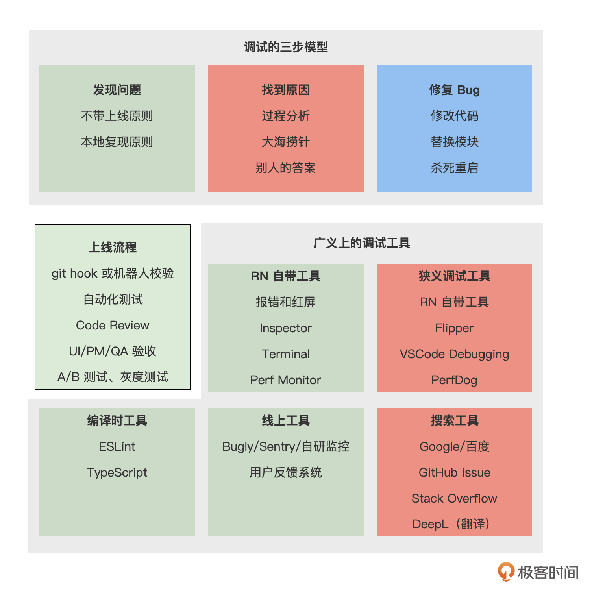
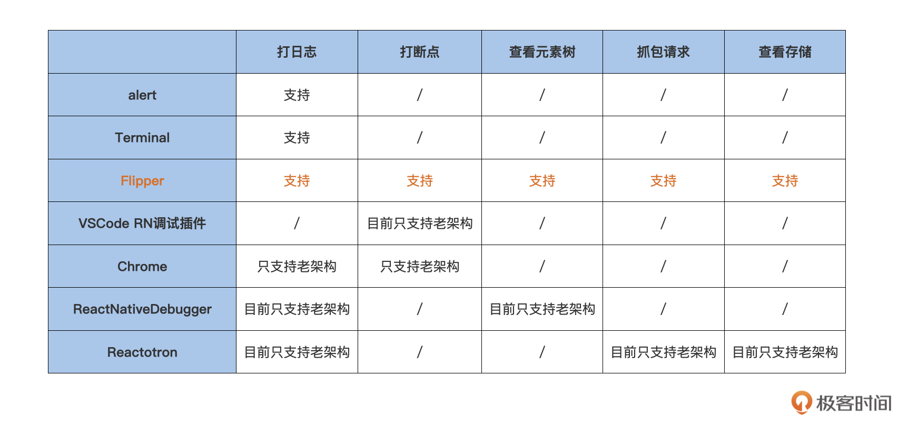

# 10｜Debug：解决 BUG 思路有哪些？
你好，我是蒋宏伟。

传说中，比尔盖茨在飞机上顺手撸一个 BASIC 解释器，不 Debug 就能直接跑起来。虽然比尔盖茨是“传说级”的程序员，但他写代码也是需要调试的。我们可以在维基百科的 [Altair BASIC](https://www.quora.com/Are-there-programmers-who-write-virtually-bug-free-code) 词条看到：

> 盖茨和艾伦从波士顿的分时租赁服务中购买了电脑上机时间来完成 BASIC 程序的调试。

但现实中，我们大部分情况都很难做到不 Debug，不调试就能把代码顺利上线，更多情况下，我们都需要和 Bug 做一番搏斗。

从搭建环境时 Gitlab 拉下来的代码跑不起来，到开发过程修改一段代码逻辑总是报错，再到产品上线后也时不时地有产品、测试、老板找过来反馈线上问题。无论是已经存在的、还是潜在的 Bug，这些都需要我们去发现和解决。不是有调侃的话么？我们程序员“不是在解决 Bug 的路上，就是在写 Bug 的路上”。

这话虽然只是一句调侃，但是这也侧面印证了两点：一方面是，我们会遇到很多 Bug，也会花很多时间去解决 Bug；另一方面是，我们直接裸写的代码可能存在较多的潜藏 Bug，我们得花精力把这些潜藏的 Bug 给找出来。那面对这些 Bug，有没有什么通用的解决思路呢？

这正是今天我要和你介绍的，我把它概括为“1+2+3”，也就是一个模型，两个原则，三条思路。

## 一个模型：发现问题、找到原因、修复 Bug

那么，一个模型是什么呢？

一个模型指的是， **发现问题**、 **找到原因**、 **修复 Bug** 的三步模型。其实这就是我们日常解决 Bug 的常规步骤，我只不过把它划分归类了一下，接着你就会看到划分的好处了。

虽然我们遇到的 Bug 形形色色、各不相同，但当你把解决问题划分为三步之后，我们就可以针对不同的步骤给出不同的解题思路了。每个 Bug 都有每个 Bug 修复的思路，但大部分的 Bug 在发现问题和找到原因这两步，是可以找到一些通用方法的。而我接下来要讲的“两个原则”，说的就是发现问题这一步的两个原则，“三条思路”说的就是找到原因这一步的三个思路，这些原则和思路都是通用的。

在发现问题和找到原因这两步中，我们也离不开团队成员的相互协作，以及各种调试工具支持。因此，在讲原则和思路的过程中，我也会和你介绍流程该怎么走，工具该怎么用。

另外，这里还需要你注意，狭义和广义调试是有所不同的。狭义的调试，指的是代码运行时打日志、打断点；但广义的调试，指的是发现问题和解决问题的过程（Debugging is the process of finding and resolving bug）。

任何能够帮助我们发现和解决问题的工具，都可以归类为广义的调试工具，甚至上线流程也是可以为调试服务的。当你把视野打开之后，思路也变广一些，这可以让你可以更快地、更容易地发现问题和解决问题。

我给你画了一张调试的全貌示意图，把调试的三步模型、上线流程和广义上的调试工具都画上去了。你先停下来看一下，接下来我也会进行更详细的介绍。

## 两个原则：不带上线原则和本地复现原则

我先和你介绍发现问题这一步的两个原则：不带上线原则和本地复现原则。

1. 不带上线原则：要尽可能早地在本地开发时发现问题，提前发现问题是不带 Bug 上线的必要条件；
2. 本地复现原则：如果 Bug 已经被带上线了，我们要尽快发现它，还要尽可能多地收集线上信息，让它能更容易地在自己的手机或本地复现。

不带上线原则怎么实践呢？首先，我们要清楚，没有任何的线上 Bug 是不可能的，但我们可以减少带上线的风险，比如团队成员之间可以通过合作建立一套完善的上线流程，依靠流程和机制来减少风险。其次，在这套流程和机制下，我们自己可以选择合适的工具来减少风险。

那么，一个理想的上线流程和配套工具是什么样的呢？我认为 GitHub 社区其实已经为我们提供了一种答案。

GitHub 社区中那些流行的仓库都有一套完整的上线流程，比如 React、React Native 仓库，一般都有 **自动化的本地校验和线上校验，还有项目成员的 Code Review**。这套流程经历了上千人的校验，我认为是非常有学习和实践价值的。

在本地开发时，需要针对开发的新增的模块写一个新的单元测试。在提交代码的时候，有 git hook 的自动脚本来执行我们的 Jest 单元测试，并校验 TypeScript、ESLint 是否通过，只有校验通过之后才能提交。在提交到远程仓库后，还有机器人再校验一次，并且只有在机器人校验和项目成员的 Code Review 通过后才能把代码合到主分支。

而理想上线流程的另一套答案，其实也是大部分团队都在实践的答案。

当我们把新功能推到的代码仓库的主分支中，我们还需要把主分支中的代码进行上线。在上线过程中，我们需要靠 UI 验收、靠 QA 测试、靠 PM 体验，靠团队的力量来尽早发现 Bug。必要的时候，还可以在上线平台上下功夫，比如只有 QA 拥有上线权限，又比如做 A/B 测试、灰度测试等。

但即便如此，也难免会将一些本地 Bug 带上线，因此我们还需要快速发现线上 Bug。

大部分时候，那些线上的、偶现的、没有报错信息的 Bug，比本地的、必现的、有报错信息的 Bug，更加缺乏有效信息，也更难发现。对于线上 Bug 而言， **快速发现线上 Bug关键是对线上数据的收集，并通过收集的数据来进行分析，使其能在本地复现**。线上 Bug 本地复现之后，剩下的修复思路就和本地 Bug 的修复思路是一样的了。

这个时候，我们有两种工具可以利用，一种是监控系统，另一种是用户反馈系统。

在技术层面接入一套监控系统，比如腾讯出品的常用于原生应用监控的 Bugly，或者开源领域的 Sentry，又或者是自研的监控平台，这些都是可以的。在产品层面上，我们需要有一套用户反馈机制，它们的核心作用是发现那些本地难以复现、又缺乏线上报错数据的 Bug。

实际上，每个团队、每个项目的情况都不一样，你可以根据自己项目的情况进行选择。

## 三条思路：一推理、二分法、三问人

发现问题之后，接着就要寻找问题的原因。寻找问题的原因有哪些思路呢？我有 三条思路供你参考：“一推理”、“二分法”、“三问人”。

所谓的“一推理”，它指的是，我们遇到问题首先要做的是 **冷静地思考、分析和推理**，要搞清楚问题是什么，知道问题是什么了，能直接解决的就自己直接解决，不要一开始就去网上搜答案。网上答案很多，但搜索正确答案成本很高，而且别人的答案不一定能解决你的问题。

你不妨先从红屏报错中提炼有用信息，再检查代码逻辑是否有明显错误并得出初步判断，然后打日志、打断点，再重新跑一次代码，验证你的判断。如果遇到的是复杂代码，可以从代码模块的出口入口着手来判断，然后再分析代码内部细节。在分析阶段中，我们也离不开（狭义）调试工具的支持。

- **红屏信息：**

  对于那些本地的、必现的、有红屏报错的 Bug 而言，红屏信息有时候能帮你直接指出是你的代码哪里有问题。

即便是那些没有提供具体报错代码的红屏报错，也会提供一些有用信息，只是这些有用信息需要你想一下才能分析出来。有些人在遇到红屏报错时，只是稍微看了一眼红屏信息，并不会去仔细地研究红屏信息内容，就直接动手开始改起代码了。这就相当于，有一份地图你不用，就直接闯起了迷宫。

**当你遇到红屏时，应该先认真读一遍红屏中的报错信息，第一遍没读懂没关系再多读几遍**，英文不熟也不要紧，可以翻译一下，看看有什么关键字，再仔细想一下。很多时候，当你真的这么做了就找到原因了，不用后面那些分析步骤了。

- **检查逻辑：**

  有时候呢，我们可以根据红屏提供的执行结果，猜出大致的问题范围。这时候呢，你可以先在脑袋里面过一遍代码执行过程，先检查一下自己是不是有拼写错误、API 的使用方法对不对、一些边际条件有没有考虑到等等。检查一遍之后，即便没有找到原因，心里多多少少会有一些判断。

- **执行代码：**

  在你有这些判断后，你就可以通过打日志、打断点等方式来验证你的判断，找到到底是哪个变量或者是哪段逻辑有问题了。

这里需要和你强调的是，不要一上来毫无头绪就开始打日志、打断点，这样做效率很低。 **一定要先检查代码、先判断原因，再去打日志、打断点去验证你的判断，这样你的调试能力、逻辑能力才会慢慢变强，调试速度才能慢慢提高。**

- **出口入口：**

  有时候代码太复杂了，代码内部执行的步骤太多了，要寻找是具体是哪段逻辑有问题就太难了。这时候，你可以先对代码的入口或出口的数据进行分析。比如，函数组件可能有问题，你可以通过工具查看元素树的结构和具体元素属性；又比如，前后端交互的请求可能有问题，你可以抓包看请求内容；再比如，本地磁盘存储结果有问题，你可以去查看存储结果。

从出口和入口开始分析先得出结论，再打日志、打断点定位问题原因，有时候可能比直接分析复杂代码的内部逻辑得出结论，要更快一些。

- **分析工具：**

  在分析阶段，必不可少的就是（狭义）调试工具，像打日志、打断点、抓包请求、查看存储这些功能都需要调试工具的支持。我给你画了一张调试工具功能图，涵盖了各类调试工具的支持程度：

我们简单分析下这几个工具。首先是弹窗 alert，它的好处是依赖任何环境，但一个弹窗能展示的内容太少了，只有在线上环境我才会用到它。

接着是终端 Terminal，你在本地通过 Terminal 启动打包工具 Metro 的服务时，你的调试代码就和 Terminal 建立了连接，你通过 console.log 打印的日志，都会在 Terminal 显示。使用它时，你不必单独下载其他任何的调试工具。据我所知，很多人排查问题只靠 Terminal 打日志，但实际上还有其他更好用的工具。

比如 Facebook 出品的移动应用调试工具 Flipper 就不错，但你需要单独进行下载。它的功能很强大，打日志、打断点、查看元素树、抓包请求、查看存储它都支持，而且支持扩展插件。

比较流行的调试工具还有 React Native Debugger、Reactotron，如果涉及原生代码，你还可用 Android Studio、Xcode 进行调试。

这些工具你不必每个都要学会怎么使用，选择几个你顺手的即可。工具只是辅助，关键是分析本身，调试工具只要够用就行。我平时用得比较多的是 Terminal 和 Flipper。

看完第一招，我们再来看第二招：“二分法”。

在你遇到不知道是什么原因引起的 Bug 时，你可以试试这招。 **所谓的“二分法”，** 说的是在我们不能确定问题原因的时候， **把所有潜在的问题都用类似“数组二分查找”的方式把代码遍历一遍，** 不断缩小问题的范围，最终找到问题原因。

“二分法”怎么分呢？一个排除疑难杂症的通用思路是这样的，我们的代码是运行在环境中的，代码本身也有多个版本的、同一个版本中代码也是分多个模块的。那我们就可以从环境、版本、模块入手排查。

我们先把环境和代码分开，先排查环境原因，如果别人的电脑、手机都没有问题，我的有问题，那就可以判断是我的电脑、手机的环境有问题，否则就是代码问题。

如果是代码问题，我们再排查上一个上线版本有没有问题，上一次 commit 的代码有没有问题，如果上一次也有问题就是历史遗留问题，否则就是新引入的问题。

如果是新引入的问题，再从根组件开始排查，一个 React Native 应用（或页面）只有一个 Root 组件，一个 Root 组件有若干个子组件，子组件又有自己的子子组件，这就组成了一个组件树，你只要顺着 Root 组件一步一步地进行二分判断，看哪一边的子树是有问题的，哪一边的子树是没有问题的，最终就能确定问题代码的范围了。

“二分法”的思路是从整体到局部，它还有一个变种就是“多分法”。比如首屏性能问题，用户从点击、到请求、再到渲染的过程是一个整体，你可以把这个整体中各个阶段中的关键节点都埋上性能统计埋点，找到那些优化收益率高的、做起来容易的地方去优化。只有从整体的视角出发，分析出每个局部的优化空间有多少，你才能判断各个技术方案的投入产出比（ROI），做出全局最优的决定。

如果前面两招用完，还解决不了问题呢？不用着急，我们还有 **第三招：三问人。**

**所谓的“三问人”，说的是我们借鉴别人的经验来解决自己的问题，别人可以是同事、朋友、微信群，也可以是搜索引擎。**

搜索引擎相信你也经常用，所以我只和你重点说一下我的使用技巧和经验。

首先，Google 搜到的资料更全一些有博客、论坛、GitHub、学习型网站，百度搜到的大多是国内开发者的博客。另一类就是专业的技术网站，比如 GitHub 和 Stack Overflow，这类专业技术提供的搜索引擎的搜索效率，有时候比 Google 还要更高一些。有时候我在 Google 搜索出的内容不是我想要的，我就会跑到 GitHub 的 React Native 仓库的 Issues 中和 Stack Overflow 上直接搜索，它们推荐的内容就会更加精准一些。

有些英语差的同学可以会觉得，使用 Google、GitHub 这类以英文为主的网站，语言是个门槛。我的建议是你多用翻译引擎，使用工具来打破这个语言门槛。你不着急的时候，英语文章可以一个词地一个词地慢慢看，这也能提升自己的英语水平，但工作中毕竟是以效率优先，我推荐你使用 DeepL 翻译引擎，在 DeepL 的宣传资料中，它的中英互译的准确性比 Google 等翻译引擎要强上 5 倍，我的实际使用感受也确实是准确很多。

## 课程小结

广义上讲，调试就是发现问题和解决问题。那如何调试呢？我有 “一个模型、两个原则、三条思路”和你分享。

- 一个模型：这个模型包括，调试的三个步骤发现问题、找到原因、修复 Bug，还包括配套的广义调试工具、团队上线流程。这个广义的调试模型，相对于狭义上的调试，它的意义在于能帮我们扩宽解决 Bug 的思路；
- 两个原则：这两个原则是不带上线原则和本地复现原则。不带上线原则强调的是，调试不仅仅是解决问题，更是提前发现问题减少线上 Bug；本地复现原则强调的是，解决线上 Bug 的关键是能在本地复现问题，而复现问题很依赖监控系统和反馈系统；
- 三条思路：你可以先用“一推理”，再用“二分法”、最后是“三问人”来解决具体 Bug 。

## 补充材料

**自带工具：**

- [react-native doctor](https://reactnative.dev/blog/2019/11/18/react-native-doctor)：可以帮忙检查本地环境是否搭建是否有问题。
- [Perf Monitor](https://reactnative.dev/docs/debugging#performance-monitor)：调试情况下摇一摇手机，就会有一个弹窗，其中 Perf Monitor 功能可以帮你查看本地的 JavaScript FPS 和 Native FPS。
- [Inspect](https://reactnative.dev/docs/debugging#inspecting-component-instances)：摇一摇中的 Inspect 功能，可以帮我们查看组件树的结构。

**搜索工具：**

- 翻译： [DeepL](https://www.deepl.com/translator)、谷歌翻译 百度翻译。DeepL 还有客户端，配合快捷键使用更方便。
- 搜索：谷歌搜索、百度搜索
- 专业网站： [React Native GitHub Issues](https://github.com/facebook/react-native/search?type=issues)、 [Stack Overflow](https://stackoverflow.com/)

**第三方工具：**

- **（推荐）Facebook 推出的移动应用调试工具** [Flipper](https://fbflipper.com/)；
- （不推荐）微软推出的 VSCode 插件 [React Native Tools](https://marketplace.visualstudio.com/items?itemName=msjsdiag.vscode-react-native)；
- （不推荐）Infinitered 推出的 [Reactotron](https://github.com/infinitered/reactotron)；
- （不推荐） [React Native Debugger](https://github.com/jhen0409/react-native-debugger)。

## 作业

- 平时你用的调试工具是什么？你为什么选择它？
- 结合这一讲提供的 “一个模型、两个原则、三条思路”，思考一下，你遇到过那些疑难杂症，最终你是怎么解决它的？

欢迎在评论区写下你的思考和想法。我是蒋宏伟，咱们下节课见。