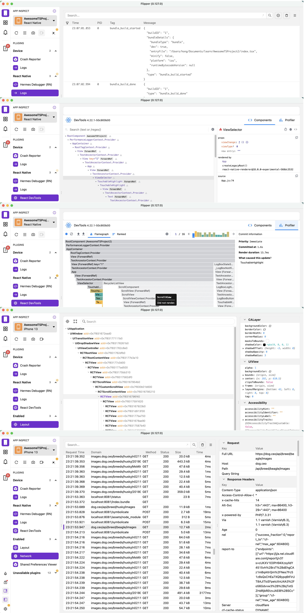
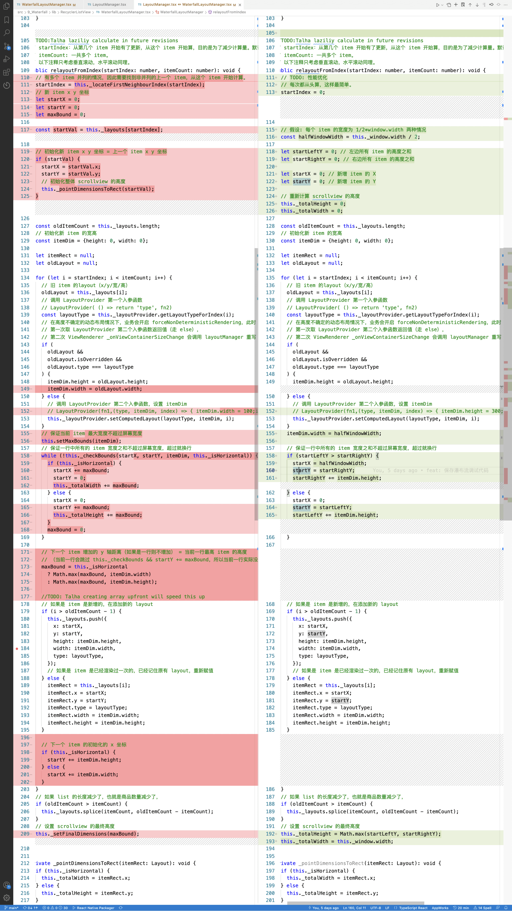

# 11｜组件实战：如何实现瀑布流？
你好，我是蒋宏伟。

现在，国内购物 App 的首页大都采用了双列瀑布流的布局，假如你的产品经理也想实现同样的瀑布流效果，你在网上找了很多的 React Native 列表组件，但都满足不了需求，你会怎么办？你会选择改让产品改方案，还是自己再研究研究？

大概是 2019 年的时候，我们的产品也提了同样的需求，使用 React Native 实现瀑布流效果。当时我们有个同事试了很多方案，比如双 List、多层嵌套 List，性能都很差效果不好，后来我们开会的时候提到了这个问题，我也参与了讨论。

当时我提出了一种思路：改 RecyclerListView 的源码。我说，RecyclerListView 的布局原理是绝对定位，每个 item 的 x、y 轴坐标是根据传入的 height、width 值算出来的，现在它的布局算法是单列的，我们只要把单列布局算法改成双列布局算法，这件事情应该能成。

后来我们团队的另一个大牛把它落地实现了，实现了一个 React Native 瀑布流页面。

在准备写实战案例的时候，我又想起了当初的这个事情。使用瀑布流的业务场景很多，却没有直接能用的开源方案，但它的实现原理其实并不复杂，应该是一个很好的实战案例。于是我就基于 RecyclerListView 最新的版本，又实现了一版。

我今天就和你讲讲，我是如何通过修改 RecyclerListView 组件的源码，实现瀑布流效果的。希望你能通过这次实战，把我们以前学的知识和技巧都用起来。也只有通过实战才能 **把知识变成能力**，快和我一起动手试试吧。

## 准备开发调试环境

关于 RecyclerListView 的基础用法，我在《List》一讲中已经介绍，它主要是通过列表数据 dataProvider 来驱动列表项的渲染 rowRenderer，并且指定为列表项指定了布局方式 layoutProvider。

现在，你需要做的是准备开发调试环境。准备开发调试环境永远是第一步，而且现在我们要调试的是放在 node\_modeuls 目录下的第三方组件 RecyclerListView，所以现在我们要准备 **第三方依赖包的开发调试环境**，这怎么准备呢？

在 React Native 中，我们是通过 import 导入第三方模块 RecyclerListView 的：

```plain
import {RecyclerListView, DataProvider, LayoutProvider} from 'recyclerlistview';

```

这段代码的意思是从 `recyclerlistview` 模块中导入 RecyclerListView 组件、DataProvider 列表数据类、LayoutProvider 布局方式类。

那 `recyclerlistview` 模块到底在哪呢？通常情况下，该模块是 `node_modules/recyclerlistview` 目录下的 `index.js` 文件 `export` 导出的模块。不过第三方库，也可以通过 `package.json` 中的 `main` 字段进行配置。 `recyclerlistview` 采用的就是这种配置方法：

```plain
// node_modules/recyclerlistview/package.json
{
  "name": "recyclerlistview",
  "main": "dist/reactnative/index.js",
  ...
}

```

你看，在 `recyclerlistview` 的 `package.json` 文件中，它通过 `main` 参数指定了模块路径 `dist/reactnative/index.js`。

但你再看下 `recyclerlistview` 的目录：

```plain
node_modules/recyclerlistview/
├── dist
│   └── reactnative
│       ├── core
│       └── index.js
├── src
│   ├── core
│   └── index.ts
└── package.json

```

你会发现， `dist` 目录下放的是编译后的 .js 文件。也就是说，如果我们直接跑项目，只能调试编译后的 .js 文件，不能调试放在 `src` 目录中的 .ts 源码。

那怎样才能调试 .ts 的源码文件呢？有一招很简单，修改 `recyclerlistview` 的导出模块的配置：

```plain
// node_modules/recyclerlistview/package.json

- "main": "dist/reactnative/index.js"
+ "main": "src/index.ts"

```

你只需把 `recyclerlistview/package.json` 的 `main` 参数改为 `src/index.ts` 即可，React Native 会在编译时通过 babel 将 .ts、.tsx 文件编译为 .js 文件再执行。

改完之后，你再重新跑一次 `yarn start` ，会遇到一个报错：

```plain
error: node_modules/recyclerlistview/src/core/RecyclerListView.tsx:

`import debounce = require('lodash.debounce')` is not supported by @babel/plugin-transform-typescript

Please consider using `import debounce from 'lodash.debounce';` alongside Typescript's --allowSyntheticDefaultImports option.

> 21 | import debounce = require('lodash.debounce');
     | ^^^^^^^^^^^^^^^^^^^^^^^^^^^^^^^^^^^^^^^^^^^^^

```

现在我们来分析这个报错信息。你还记得解决具体 BUG 的顺序吗？“一推理”、“二分法”、“三问人”。

遇到报错先不用着急去网上搜，先看看红屏的报错提示。第一行报错，说的是 `core/RecyclerListView.tsx` 文件中有报错。第二行，说的是 `@babel/plugin-transform-typescript` 插件不支持 `import = require()` 的导入语法。第三行，直接把建议答案告诉你了，你可以用 `import from` 的语法进行导入。第四行，提示了具体是哪行代码报错了。

你看，这类报错信息都把答案都告诉我们了，我们只要认真读一下就行，我们的“一推理”刚刚开始，就把这个 BUG 解决了，都用不着后面的“二分法”和“三问人”。

在你把代码跑起来后，还需要准备一下调试工具 Flipper 和 React Native Tool。

Flipper 调试工具，你只需要下载一下就行，它的功能很强大：



这张长截图显示了 Flipper 的功能，从上到下依次是打印日志 Logs、组件树 Components、性能火焰图 Profiler、宿主组件树和布局 Layout、网络请求 Network。它还有一个功能是支持 Hermes 引擎 Debugger，它和浏览器的 Debugger 类似，这里我没有进行截图了。

现在 RecyclerListView 源码已经跑起来了，调试环境也已经准备完成，接着下一步就是找到控制布局的关键源码。

## 找到关键源码

要找到关键源码，我们得先从整体上理解源码。很多人读源码没有方法，不知道从哪里入手，甚至有些程序员从来没有读过别人的源码。其实写代码和读代码，就像写文章和读文章的关系一样， **没有大量的阅读积累，怎么能写出好的代码呢？**

理解 RecyclerListView 这类复合组件的源码，我有一个技巧，就是从复合组件 JSX 部分开始切入。

这时我们能直接观察到的是 UI 视图，以 UI 视图为锚点，去理解 JSX 文件就很容易了。在你了解 JSX 之后，再根据状态 `state` 和属性 `props` 去推断组件的内部逻辑 `f` ，会容易很多。一个页面，无非也就是由这几个部分组成：

```plain
UI/JSX = f(state, props)

```

了解了基本方法，现在我们开始分析RecyclerListView组件的源码，请你先 **在本地打开** [RecyclerListView 的源码文件](https://github.com/Flipkart/recyclerlistview/blob/master/src/core/RecyclerListView.tsx)。下面是我从 RecyclerListView 类组件摘出来的 3 个和 JSX 相关的方法：

```plain
// node_modules/recyclerlistview/src/core/RecyclerListView.tsx
public renderCompat() { // 先调用 render 后调用它
  return (
    <ScrollComponent>
      {this._generateRenderStack()}
    </ScrollComponent>
  );
}

private _generateRenderStack(){
  for(const key in this.state.renderStack){
    renderedItems.push(this._renderRowUsingMeta(this.state.renderStack[key]))
  }
  return renderedItems
}

private _renderRowUsingMeta() {return <ViewRenderer/>}

```

它们分别是：

- `renderCompat` 方法：实际就是类组件的 `render` 方法，它最外层是一个滚动组件 `ScrollComponent` ；
- `_generateRenderStack` 方法：循环了状态 `state.renderStack`，生成了若干个 `renderedItems`；
- `_renderRowUsingMeta` 方法：返回的是具体的 `renderedItems` ，也就是 `ViewRenderer` 容器元素。

当你把 UI 视图和 JSX 部分联系在一起时你就明白了，RecyclerListView 渲染出的 UI 页面，是由一个滚动容器和若干个 `ViewRenderer` 容器组成的。

我们还是回到最基础的 UI 公式：

```plain
UI/JSX = f(state, props)

```

现在我们已知 **JSX** 是 ScrollView + View，已知 **state** 是用 `for...in` 循环的对象 renderStack，还已知 RecyclerListView 的三个必传 **props**：列表数据 dataProvider(dp)、列表项的布局方法 layoutProvider、列表项的渲染函数 rowRenderer。

这时虽然你还不知道组件内部逻辑 `f` 具体是什么，但是你应该已经把握住了函数的“入口”和“出口”，你知道放进去的入参是什么，能够产出的 UI 又是什么。知道了“入口”“出口”的特点后，再从两端往中间推理，理解组件内部逻辑 `f` 就会变得简单很多。

这时候，你可能会有一些关于内部逻辑 `f` 的问题，你或许想问 `state.renderStack` 和三个 props 是怎么控制 JSX 的？

那我们就要再仔细读一下 `_renderRowUsingMeta` 中的代码了：

```plain
private _renderRowUsingMeta(itemMeta: RenderStackItem): JSX.Element | null {
  const dataIndex = itemMeta.dataIndex;
  const data = this.props.dataProvider.getDataForIndex(dataIndex);
  const type = this.props.layoutProvider.getLayoutTypeForIndex(dataIndex);
  return (
    <ViewRenderer
      data={data}
      layoutType={type}
      index={dataIndex}
      layoutProvider={this.props.layoutProvider}
      childRenderer={this.props.rowRenderer}
    />
  );
}

```

在这段源码中，我只标记出了 state、props 和 ViewRenderer 三个部分，即便只有这些代码片段，你可以猜出它的大致逻辑。

状态 `state.renderStack[key]` 就是 `itemMeta`，每个 `itemMeta` 的 `dataIndex` 是不一样的，通过 `dataIndex` 从列表数据 dataProvider 和布局方法 layoutProvider 中，选取了对应项的数据 `data` 和布局类型 `type` ，并将这些值和列表项的渲染函数 rowRenderer 都赋值给了 `ViewRenderer` 的 `childRenderer` 属性。

读完这段源码片段，你大概能够补全此段代码的内部逻辑 `f`。 `ViewRenderer` 是一个容器，内部装的是你传给它的渲染函数 rowRenderer 方法，并且按照你指定的数据 `data`、类型 `type` 进行渲染。

因为 `ViewRenderer` 是你指定的列表项 `rowRenderer` 的父容器，父容器的位置决定了你列表项的位置。这时候，你再读一遍 `_renderRowUsingMeta` 的源码：

```plain
  private _renderRowUsingMeta(itemMeta: RenderStackItem): JSX.Element | null {
    const dataSize = this.props.dataProvider.getSize();
    const dataIndex = itemMeta.dataIndex;
    const itemRect = (
    this._virtualRenderer.getLayoutManager() as LayoutManager
    ).getLayouts()[dataIndex];
    return (
      <ViewRenderer
        key={key}
        data={data}
        x={itemRect.x}
        y={itemRect.y}
        layoutType={type}
        index={dataIndex}
        layoutProvider={this.props.layoutProvider}
        onSizeChanged={this._onViewContainerSizeChange}
        childRenderer={this.props.rowRenderer}
        height={itemRect.height}
        width={itemRect.width}
      />
    );
  }

```

在这个源码片段中，这些由 `LayoutManager` 类的 `getLayouts` 方法生成的 x/y/width/height 属性，就是决定你列表项布局方式的关键源码。

但 `getLayouts` 到底是什么呢？请你打开 `LayoutManager` 类的源码：

```plain
// node_modules/recyclerlistview/src/core/layoutmanager/LayoutManager.ts
   public getLayouts(): Layout[] {
        return this._layouts;
   }

    public relayoutFromIndex(): void {
        let startX = 0;
        let startY = 0;
        let maxBound = 0;

        for () {
            oldLayout = this._layouts[i];
            if () {
                itemDim.height = oldLayout.height;
                itemDim.width = oldLayout.width;
                maxBound = 0;
            }
            while () {
                startX = 0;
                startY += maxBound;
            }

            maxBound = Math.max(maxBound, itemDim.height);
            this._layouts.push({ x: startX, y: startY, height: itemDim.height, width: itemDim.width, type: layoutType });

        }
    }

```

上述的代码片段是 `getLayouts` 方法和设置 `this._layouts` 的 `relayoutFromIndex` 方法。大致扫一眼，你就能明白 `relayoutFromIndex` 方法通过一堆计算，计算出了实现单列布局的 x/y/height/width 值，然后把它们作为对象 push 到了 `this._layouts`。

而 ViewRenderer 根据 `this._layouts` 把你的列表项，渲染到了指定的位置上。因此，我们要想实现双列瀑布流布局，就得理解和修改 `relayoutFromIndex` 方法。

## 修改源码

在“找到关键源码”这一步，我们读源码其实只要有宏观上的理解就行了，但要“修改别人源码”就需要更微观上的理解了。

我说的宏观上理解源码，讲究的是速度，大致理解就行，细节上有点小偏差也不要紧。但微观上理解源码，讲究的是准确，我们要改别人的源码，理解要是不准确，改起来肯定容易出问题。

在提高理解的准确性上，我是这么做的。首先我会使用断点工具，一行一行地执行代码，并对上下文中的变量进行一些“终极拷问”：“变量从哪来”、“变量用到哪里去”、“变量的意义是什么”，再把自己的理解马上备注起来，不然容易忘。

在微观理解上，我们也要找到切入点。比如，在理解 `relayoutFromIndex` 方法时，我找的切入点就是设置列表项的 x/y。设置 x/y 的核心代码如下：

```plain
  public relayoutFromIndex(itemCount: number): void {
    // 新 item x y 坐标
    let startX = 0;
    let startY = 0;
    // 记录当前一行最高元素的高度
    let maxBound = 0;

    for (let i = 0; i < itemCount; i++) {

      // 如果当前多个 item 宽度之和超过屏幕宽度就换行
      while (!this._checkBounds(startX, startY, this._layouts[i])) {
        // 将实际 x 坐标设置为 0
        startX = 0;
        // 将实际 y 坐标设置增加上一行最高 item 的高度
        startY += maxBound;
        maxBound = 0;
      }

      // 设置新的宽高
      this._layouts.push({ x: startX, y: startY, height: itemDim.height, width: itemDim.width, type: layoutType });

      // 记录当前一行最高 item 的高度
      maxBound =  Math.max(maxBound, this._layouts[i].height);
      // 默认情况下：下一个 item 的初始化的 x 坐标
      startX += itemDim.width;
    }
  }
  private _checkBounds(
    itemX: number,
    itemY: number,
    itemDim: Dimension,
  ): boolean {
    return itemX + itemDim.width <= this._window.width;
  }

```

虽然我已经把代码精简并写了备注，但理解起来可能还是有点难度，所以我还给你配了单列布局的原理示意图：


单列布局的原理是什么呢？

从代码层面看，它对你传入的列表项进行 `for` 循环遍历，并通过 `_checkBounds` 方法来判断。如果当前遍历的列表项宽度和当前一列已有列表项的宽度之和，不超过屏幕宽度，也就是 `itemX + itemDim.width <= this._window.width`，那么就跳过 `while` 循环，直接使用同一行前几个列表项的宽度之和 `startX += itemDim.width` ，作为当前列表项的 x(startX) 坐标。也就是情况一： **宽度足够，放到同一行。**

如果 `_checkBounds` 判断，同一行剩余宽度不够了，那么就进入 `while` 循环，将当前列表项的 x(startX) 坐标设置为 0，y 坐标设置增加上一行最高 item 的高度 `maxBound`。也就是情况二： **宽度不够，放到下一行。**

我还在图中给你画了一个单列布局的例子。第一行 A、B 列表项宽度正好占满整个屏幕宽度，所以列表项 C 得再起一行，其 x 坐标为 0，其 y 坐标为 A 的 y 坐标和 B 的高度 height 之和。列表项 C 横向独占了一行，所以 D、E 就只能放到下一行了。整体上看，RecyclerListView 实现的还是一种单列布局，只不过同一行中可以放置多个列表项。

理解完 RecyclerListView 的单列布局源码后，接下来就要设计我们自己的双列瀑布流布局了。我给你画了一张瀑布流的示意图：


双列瀑布流布局只有两种情况，第一种情况是如果左边已有列表项的高度之和 `startLeftY` 大于右边已有列表项的高度之和 `startRightY`，那么下一个列表项就要放右边。第二种情况则刚好相反，我们需要把下一个列表项放在左边。简单来说就是， **左高放右、右高放左。**

我同样给你举了一个例子，你可以对照双列瀑布流布局的图片看一下。起始时左右两边一样高，所以先是左 A，再是右 B。接下来，由于左边比右边高，所以再是右 C，最后是左 D。如果是单列布局，C 应该放在左边，D 应该放在右边，这就是双列瀑布流布局和单列布局不同之处。

双列瀑布流实现的核心代码如下：

```plain
  public relayoutFromIndex(startIndex: number, itemCount: number): void {

    // 假设: 每个 item 的宽度为 1/2*window.width 两种情况
    const halfWindowWidth = this._window.width / 2;

    let startLeftY = 0; // 左边所有 item 的高度之和
    let startRightY = 0; // 右边所有 item 的高度之和

    let startX = 0; // 新增 item 的 X
    let startY = 0; // 新增 item 的 Y

    for (let i = startIndex; i < itemCount; i++) {
      itemDim.height = oldLayout.height;
      itemDim.width = halfWindowWidth;

      // 保证一行中所有的 item 宽度之和不超过屏幕宽度，超过就换行
      if (startLeftY > startRightY) {
        startX = halfWindowWidth;
        startY = startRightY;
        startRightY += itemDim.height;
      } else {
        startX = 0;
        startY = startLeftY;
        startLeftY += itemDim.height;
      }

      // 如果是 item 是新增的，在添加新的 layout
      this._layouts.push({x: startX, y: startY, height: itemDim.height, width: itemDim.width, type: layoutType,});
  }

```

首先，双列瀑布流有一个假设，假设每个列表项的宽度为屏幕的一半。其次，我们还需要记录左边的高度之和 `startLeftY` 和右边的高度之和 `startRightY`。在 `for` 遍历列表项时，如果左边高 `startLeftY > startRightY`，那么当前列表项放右边 `startX = halfWindowWidth`，否则当前列表项放左边 `startX = 0`，同时记录最新的左边/右边高度之和。最后把当前列表项 push 到 `this._layouts` 中。

将单列布局改为双列瀑布流布局，改动的代码量很少，你可以现在就动手试一试。我也将我改动的代码前后对比图，放在了下面，你可以参考一下：



## 保存修改

现在，我们来到了最后一步保存修改的源码。

在修改完 node\_modules 中的源码后，如果不进行保存，很有可能就会丢失。并且，有时候我们需要和同事进行合作，同事也需要我们修改后的代码，又或者是在使用上线平台进行打包时，也需要将修改后的 node\_modules 源码同步给上线平台一份。本地修改 node\_modules 源码后，不保存、不同步肯定会出线上问题。

怎么把修改好的 node\_modules 代码保存呢？有三种思路：

第一种 **直接复制源码**。但复制源码后续想要升级 RecyclerListview 的版本会非常困难，每次升级可能面临的是一次重新改造。

第二种 **在运行时进行修改**。这种方法对源码的侵入性小，但每次升级前我们还是需要手动检查一下的，不然相关代码逻辑有变化，我们的修改就会受到影响。

我在这次实战中，采用的就是在运行时进行修改的方案。我观察了一下 RecyclerListview 的代码，它的代码风格是面向对象的编程风格，几乎把所有的内部类都暴露出来了。

但由于它 LayoutManager 类的所有属性是私有属性，我没办法通过继承的方式读取到 LayoutManager 的私有属性。

因此我复制了 `LayoutManager` 和 `layoutProvider` 类，并将其重写为 `WaterfallLayoutManager` 和 `WaterfallLayoutProvider`。

当你的列表是单列布局时，就应该使用 `layoutProvider` 类 ，当你的列表是双列瀑布流布局时，就可以使用我创建的 `WaterfallLayoutProvider` 类。

第三种 **在编译时修改**。这里利用的是 `patch-package` 即时修复第三方 npm 包的能力，它的原理是先对你的修改进行保存，然后在你每次安装 npm 包的时候把你原先的修改给注入进去，也就是 patch package。它是侵入式的修改方式，步骤如下：

在修改完 node\_modules 目录下的 RecyclerListview 文件后，你直接运行如下命令：

```plain
$ npx patch-package some-package

```

这时你修改的代码就会以 patch 文件的形式进行保存，patch 文件的示例代码如下：

```plain
diff --git a/node_modules/recyclerlistview/src/core/layoutmanager/LayoutManager.ts b/node_modules/recyclerlistview/src/core/layoutmanager/LayoutManager.ts
index e9454a4..3168330 100644

--- a/node_modules/recyclerlistview/src/core/layoutmanager/LayoutManager.ts
+++ b/node_modules/recyclerlistview/src/core/layoutmanager/LayoutManager.ts

@@ -95,75 +95,113 @@ export class WrapGridLayoutManager extends LayoutManager {
         }
     }

-    public relayoutFromIndex(startIndex: number, itemCount: number): void {

+  // startIndex：从第几个 item 开始有了更新，从这个 item 开始算，目的是为了减少计算量。默认：0
+  // itemCount: 一共多个 item。
+  // 以下注释只考虑垂直滚动，水平滚动同理。
+  public relayoutFromIndex(startIndex: number, itemCount: number): void {

     private _pointDimensionsToRect(itemRect: Layout): void {
         if (this._isHorizontal) {

```

那如果别人想用你瀑布流版本的 RecyclerListview 怎么办呢？首先，你需要修改 package.json 文件：

```plain
 // package.json
 "scripts": {
+  "postinstall": "patch-package"
 }

```

然后将修改后的 package.json 和前面自动生成的 patch 文件用 Gitlab/GitHub 保存起来。

这样，你同事下载最新代码，再执行 `npm install` 或 `yarn` 命令后，就会自动触发 `patch-package` 命令。 `patch-package` 命令会利用你生成的 patch 文件，将官方的 RecyclerListview 修改成你的瀑布流版本的 RecyclerListview。

一般来说，无论是快速修改第三方组件源码，还是修改 React Native 的 JavaScript 层的源码，我都不建议使用第一种直接复制源码的方式。我会 **优先考虑在运行时的修改方法**，通常该方案改动最小、侵入性也最小。 **如果运行时方案改不了，我才会考虑有侵入性的编译时的** `patch-package` **方案。**

## 总结

在前面的课程中，我讲的大多是概念性的知识，要消化这些概念性的知识就必须要有练习，所以我在每节课中都给你留了一道实操的练习题，目的就是帮你把知识内化为能力。这一讲中，我准备的实战案例也是为了让你把前几讲中学习到的知识灵活运用起来。

首先你需要提前准备好写代码时会用到调试工具 Flipper ，并灵活运行“一推理”、“二分法”、“三问人”的思路来解决过程中遇到的问题。

在理解别人的组件代码时，利用 `UI/JSX = f(state, props)` 这个最基本 React/React Native 原理，先找到实现 UI 的 JSX 部分，再找到 state、props，然后再理解逻辑 `f` 的部分。

在修改别人的逻辑代码时，先通过调试工具来理解各个变量上下文含义，理清楚别人的逻辑后，再根据自己目的进行修改。

最后要意识到，你修改的是别人的源码，你可以通过运行时、编译时两种方案把其保存下来。

## 附加材料

1. [patch-package](https://github.com/ds300/patch-package) 可以帮你保存对第三方模块的问题修复。
2. 本节课的源码，我放在了 [GitHub](https://github.com/jiangleo/react-native-classroom/tree/main/src/11_Waterfall) 中。

## 作业

1. 请你根据这节课的资料，实现一个三列瀑布流布局。
2. 你觉得阅读源码，有什么意义？

欢迎在评论区写下你的想法。我是蒋宏伟，咱们下节课见。