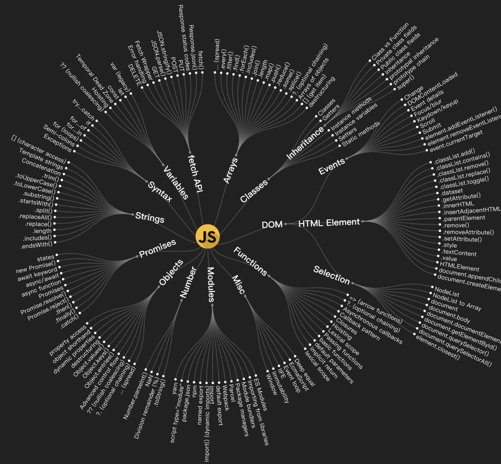
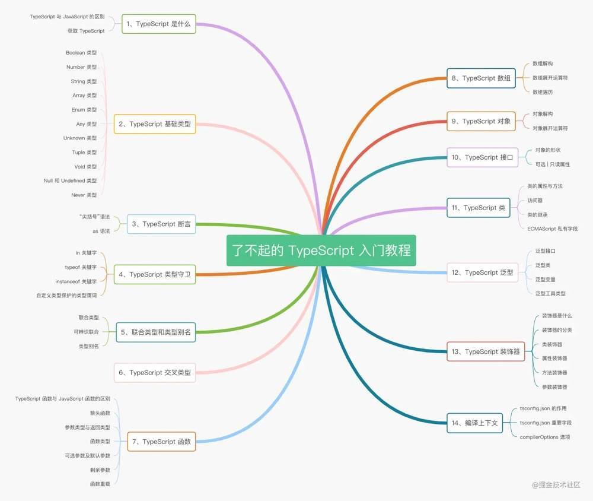
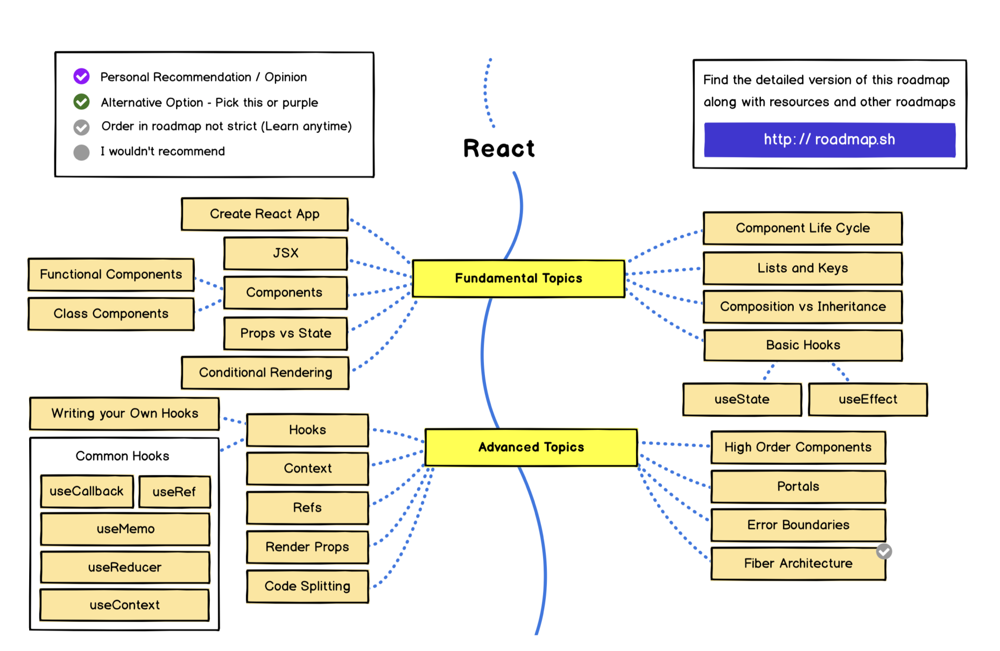
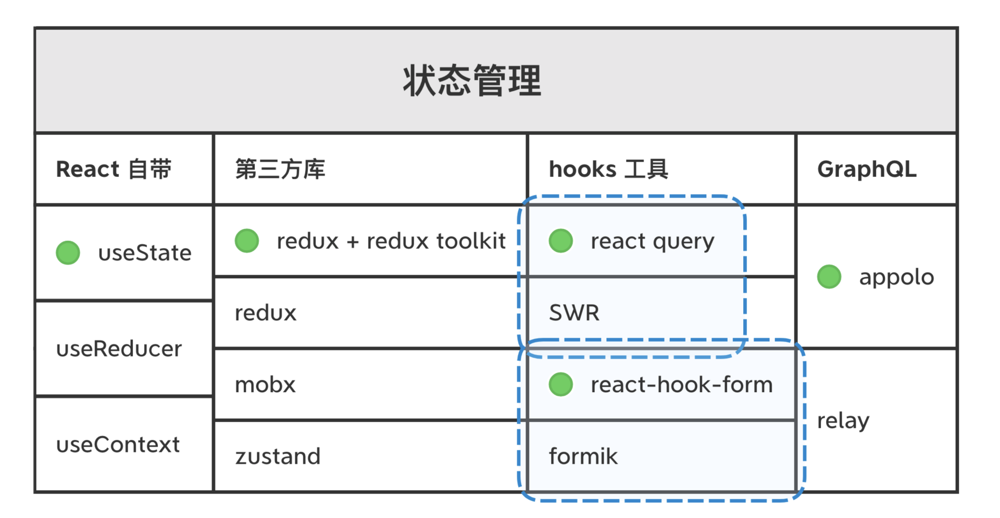

# 13｜生态：React Native Awesome
你好，我是蒋宏伟。

上一个模块我和你介绍的是 React Native 的基础知识，通过核心基础篇 12 讲的学习，你现在是否达成学习目标，可以搭建一个简单的 React Native 页面了呢？

接下来，在社区生态篇这个模块中，我们将要再进一步，学习搭建一个完整的 React Native 应用。但在搭建 React Native 应用的过程中，除了 React Native 本身的知识，我们还需要用到很多 React Native 生态中的知识和工具。

不过，React Native 生态是一个非常庞大的概念，我没有办法只用六讲，就把其中所有的知识点都讲透彻。但用更多的篇幅去讲，效果也不一定好，很多知识是用到的时候才需要去深入学习的，在此之前你只需要知道这些知识大概是干什么用的就可以了。真正用到的时候，一边实践一边学习的效果会更好。

因此，这一讲的目的不是告诉你，你还要学什么，而是告诉你，你可能会用到什么。只要在你需要的时候，你还能想到，还有这样一个技术能够解决你的问题，那今天这一讲的目的就达到了。

另外，我们这一讲采用的是 GitHub 社区 Awesome 的形式，为你推荐一些我精选的参考资料。参考资料中，有很多都是英文的，我知道你会觉得很难啃，但相信我，这些一手的英语资料能给你带来更大的帮助。

所有的推荐资料，我都帮你打上标签了，有入门类、实践类、课程类、开源库等等，你也可以把这一讲当作一个手册来用，这些标签能够方便你按需查找。

## 语言和框架

学习 React Native，我们首先需要建立起对 React Native 的整体认知，然后才是学习开发语言 JavaScript/Typescript ，以及开发框架 React。我们接下来就这个逻辑进行推荐。

**第一类：React Native 快速入门。**

首先，我们必须清楚这样一个事实，互联网行业的竞争非常激烈，技术迭代也很快，一篇技术博客发出来，你三四年后再回头看可能就过时了。我在给你挑选学习 React Native 类资料时，就面临这个问题，除了官网和一些收费网课外，能选择的太少。最后我选择了下面这几类：

- <入门-英文\> [React Native Tutorial for Beginners - Build a React Native App \[2020\]](https://www.youtube.com/watch?v=0-S5a0eXPoc)：虽然这是两年前的资料了，但绝大部分内容直到现在也没有过时，而且视频的形式，也能带着新手一步一步操作学习，效率很高；
- <网站-英文> [React Native Express](https://www.reactnative.express)：适合想快速了解 React Native 中各种概念的新人；
- <课程-英文\> [The Complete React Native + Hooks Course](https://www.udemy.com/course/the-complete-react-native-and-redux-course/)：这是优达学院最受欢迎的 React Native 视频课程。它是基于 React Native 0.62 版本开发的付费课程，内容详细而且完整，包括入门、React、Hooks、样式、导航、状态、布局、请求，以及搭建一个简易 React Native 应用，也是非常适合新手的入门课程。

**分类二：学习 JavaScript。**

如果你以前从事的是客户端开发，没有 JavaScript 开发经验，你可以参考如下资料：

- <入门-中英> [MDN JavaScript 教程](https://developer.mozilla.org/zh-CN/docs/Web/JavaScript/A_re-introduction_to_JavaScript)：MDN 是前端同学必备的网站，它的内容非常权威，如果你有编程基础，通过这一篇文章你就能快速掌握 JavaScript；
- <电子书-中文> [ES6 入门教程](https://es6.ruanyifeng.com/)：ES6 相当于 JavaScript 的一个“版本号”。ECMAScript 规范每年都会更新一个版本，ES6 对应的是 ECMAScript 2015 的版本，今年的最新版本是 ECMAScript 2022。但由于 ES6 对于 JavaScript 有划时代的意义，所以也是最广为人知的版本，你既可以它当作入门书籍一步步学习，也可以把它当作手册进行查询；
- <练习-英文> [Learn JavaScript 网站](https://learnjavascript.online/)：如果你觉得光看资料很难学好 JavaScript，你也可以用这个网站边学边练。它提供了学习 JavaScript 的思维导图，把 JavaScript 的知识分为了 13 个部分。其中的 DOM 部分虽说是浏览器的专属，但 React Native 新架构底层操作 Shadow Node 也是用的类似的 API，这一部分了解即可，不需要深入学习。你可以根据思维导图，看看自己还需要学习哪些部分。

**分类三：学习 TypeScript。**

如果你真要写业务项目的话，无论这个项目是大是小，我都推荐你用 TypeScript 而不是 JavaScript。TypeScript 的静态类型检查功能，不仅能减少潜在的线上 Bug，还能提高项目的可维护性，这些对于业务都至关重要。这部分的资料我推荐：

- <入门-中文> [1.2W字 \| 了不起的 TypeScript 入门教程](https://juejin.cn/post/6844904182843965453)：这是掘金最受欢迎的 TypeScript 入门课程，作者将 TypeScript 的入门知识分为了十四个知识点，一步步带你学习，同时作者还给了一个 TypeScript 思维导图，我把它放在了下面；

- <练习-中英> [Type Challenges](https://github.com/type-challenges/type-challenges)：如果你觉得光看文字不过瘾，你可以结合 Type Challenges 和 TypeScript 官网提供在线编辑器一起练习；
- <实用-英文> [React+TypeScript Cheatsheets](https://github.com/typescript-cheatsheets/react)：真正开发的时候，TypeScript 和 React 是结合起来一起用的，React 自定义了很多 Type 类型，使用这个小抄本能帮你快速掌握 TypeScript 和 React 结合使用的最佳实践。

**分类四：学习 React。**

对于 React 的学习，我唯一推荐的资料是 [React 新官方](https://beta.reactjs.org/)，里面的每一篇文章我都认真读过，每一篇都是经典。可惜的是，它还是 Beta 版本，官方分为两部分：

- <教程-英语> [Learn React](https://beta.reactjs.org/learn)：这部分既有初学者入门的教程，也有深入学习的教程，同时还有配套的示例和练习材料。目前 Learn React 部分完成了 70%，但对于入门和进阶来说，已完成的 Learn React 部分已经完全够用了；
- <手册-英语\> [API Reference](https://beta.reactjs.org/apis)：这部分是 React 的 API 手册，目前这部分只完成了 5%，所以你要查询 API 只能到 [React 老官网](https://zh-hans.reactjs.org/) 上去查询了。

另外，我还为你附上了 React 核心知识的学习路径图，这张图来源于 [roadmap.sh](https://roadmap.sh)，它是一个专门创建学习路线图的社区。因为你只需要学习 React 的基础知识和进阶知识，所以其中的Web 内容我去掉了，可以对照 React RoadMap 看下自己哪些已经掌握了，哪些还要进一步的学习：

## 项目工程

上一部分主要是打基础，接下来创建项目之前，我们还要考虑用项目中的技术选型，包括脚手架、包管理、状态管理、自动化测试，等等。

**第一部分：脚手架。**

在脚手架的选择上，每个团队都会有自己的偏好，创建项目的选择也不一样，你可以根据自己团队的情况四选一：

- <脚手架-中文> [react-native init](https://reactnative.dev/docs/next/environment-setup)：首先 React Native 官方提供了 react native init 命令，它属于脚手架的基础款；
- <基础设施-英文> [Expo](https://docs.expo.dev/)：它帮你集成了一系列的原生工具和能力，还能帮你构建和部署，并同时支持 Android、iOS 和 Web。Expo 不仅仅是一个脚手架，更是一套 React Native 的基础设施。在国内，主要是出海的应用在用；
- <功能模块-英文> [Expo modules](https://docs.expo.dev/bare/installing-expo-modules/)：如果你团队开发的应用，用户群主要在国内，而且需要用户自己独立构建和部署，Expo 提供的原生工具和能力也可以单独按需使用；
- <脚手架-英文> [Ignite](https://github.com/infinitered/ignite)：这是由一群美国的开发人员和设计师组成的组织 Infinite Red 开发的，这个脚手架会帮你做包管理、状态管理、自动化测试等方面技术选型，所以你不需要做这些选型和配置工作了，开箱即用就行。

**第二部分：包管理。**

在第三方包的管理上，业内常见的方案有三种。它们之间的差别并不大，但根据我的经验，我更加推荐你用 yarn。它们主要的区别在这：

- <推荐-中文> [yarn](https://yarn.bootcss.com/)：yarn是 Meta 团队开源的包管理工具，在安装包的速度上和功能上，都比 npm 更强一些。需要注意的是，你用 Yarn 的 classic 版本就可以了，yarn 的 v2、v3 版本相对 classic 版本变化太大，用的人也较少；
- <自带-中文> [npm](https://www.npmjs.cn/)：这是 node.js 自带的包管理工具，你在搭建 React Native 环境时就已经安装了 node.js，因此 npm 直接可以用；
- <更快-中文> [pnpm](https://www.pnpm.cn/)：它是比 npm 和 yarn 速度更快的包管理工具，Ignite 脚手架就是在用 pnpm 管理包。但我在使用 pnpm 搭建 React Native 的 monorepo 项目时，碰到了和打包工具 metro 的兼容问题，后续就放弃使用了。

**第三部分：状态管理。**

状态管理是一个很复杂的话题，我们这里简单介绍一下，React/React Native 的状态管理可以分为四类：

- **React 自带**：包括 [useState](https://zh-hans.reactjs.org/docs/hooks-reference.html#usestate)、 [useReducer](https://zh-hans.reactjs.org/docs/hooks-reference.html#usereducer) 和 [useContext](https://zh-hans.reactjs.org/docs/hooks-reference.html#usecontext)。当你准备用 useContext 的时候，你可能就需要使用社区状态管理工具了，因为 useContext 需要大量的手动性能优化，不适合大规模使用；
- **第三方库**：常用的方案有 [Redux + Redux Toolkit](https://redux-toolkit.js.org/)、单独的 [Redux](http://cn.redux.js.org/)、 [Mobx](https://cn.mobx.js.org/) 和 [Zustand](https://github.com/pmndrs/zustand)，在我以前做的 [《大家开发 RN 都用什么？》](https://docs.qq.com/sheet/DQWdsZ0RORkpFQmVj?tab=BB08J2) 调研报告中，我发现大家用的最多的还是 Redux，但是 Redux 单独使用起来成本高，因此我建议你配合 Redux Toolkit 一起使用；
- **hooks 工具**：hook 是一种抽象和复用组件状态逻辑的机制，因此 hooks 类工具很多，常用的、能帮我们管理部分状态 hooks 工具主要是这几类。 [react query](https://react-query.tanstack.com/) 和 [SWR](https://github.com/vercel/swr) 可以帮我们管理请求， [react-hook-form](https://github.com/react-hook-form/react-hook-form) 和 [formik](https://github.com/jaredpalmer/formik) 可以帮忙管理表单；
- **GraphQL**：现在后端接口大多是采用(类) RESTful 架构，我们用的 GET、POST 请求就是这种架构。相对于 RESTful 架构，GraphQL 提供了一种更加灵活的请求后端接口的方案。GraphQL 是一种架构模式、是一种规范，业内有两种具体的实现，一种是开源社区常用的 [Appolo](https://apollographqlcn.github.io/react-docs-cn/) 方案，另一种是 Meta 团队开源的 [Relay](https://relay.dev/) 方案。

这四类状态管理工具，不同类别之间可以灵活搭配使用，我在下面的状态管理表单图中，用绿点给你标注了我的推荐，蓝框中的工具是同一类工具，二选一即可：

**第四部分：自动化测试。**

国内业务类的测试主要还是以 QA 测试为主，但一些由技术主导的通用组件和通用工具，有时候不一定有 QA 资源帮忙测试，这时候自动化测试就能派上用场了。我这里也给出了一些推荐：

- <单元测试-中文> [Jest](https://jestjs.io/zh-Hans/)：这是 Meta 团队开发的一款 JavaScript 单元测试框架，单元测试中的单元指的是最小可测试粒度的函数单元。
- <组件测试-英文> [react-native-testing-library](https://github.com/callstack/react-native-testing-library)：这是专门用来测试 React Native 组件的。比如，它提供了 render 方法可以专门测试组件渲染是否正确，fireEvent 方法可以专门用来测试事件返回值是否正确；
- [Detox](https://github.com/wix/Detox)：它可以帮你在真机/模拟器运行测试代码，更符合真实环境。

## 样式和组件

脚手架搭建好之后，就到具体开发环节了。在这个环节中，最重要的就是组件和样式的学习。

### 样式

样式分为两类，一类是写样式的工具函数，另一类是自带风格样式的组件库，我们这里简单介绍一下，先来看看样式工具。

样式工具可以分为三小类：

- 第一类是 React Native 自带了 “CSS In JS” 的 [StyleSheet](https://reactnative.cn/docs/next/stylesheet) 接口；
- 第二类是 [StyledComponent](https://styled-components.com/) 这种方案，如果你喜欢纯正的 CSS 语法，可以选用这种；
- 第三类是 CSS 的“简拼”方案 [Tailwind](https://www.tailwindcss.cn/)，它和 CSS 的区别类似我们打字时全拼和简拼区别，能让你敲击键盘的次数更少一些，但你需要记住它的“简拼”规则，而且还有一定的性能损耗。

我认为在 React Native 中使用 StyleSheet 方案就够了，StyledComponent 和 Tailwind 并不是我的菜。

然后我们再来看看组件库。类似于 Web 中最流行的 AntDesign 组件库，React Native 也有很多自带风格样式的组件库。

虽然，移动端的 toC 应用大多都有 UI 帮忙出设计稿，开发同学需要根据设计稿定制开发，所以toC 应用基本是不用组件库的。但移动应用也有很多 toB 应用，这些应用使用组件库开发，能够解决很大一部分的开发成本。

我最推荐的是近两年最活跃的组件库 [Native Base](https://nativebase.io/)，你也可以根据你们团队的喜好选择其他风格的组件库，其他常用的还有 [React Native Elements](https://reactnativeelements.com/)、 [React Native Paper](https://reactnativepaper.com/)、 [UI Kitten](https://akveo.github.io/react-native-ui-kitten/)。

### 组件

组件包括核心组件和一些我们国内常用的组件。所谓的核心组件是我们开发 React Native 应用时使用频率很高的组件，包括路由、手势、动画，这些组件我也会在生态篇进行更详细地介绍，今天你可以先简单了解一下。

我们先来看看路由这方面有什么解决方案。其实，React Native 本身并没有提供路由解决方案，但社区提供了一些解决方案，包括 [React Navigation](https://reactnavigation.org/)、 [React Native Navigation](https://wix.github.io/react-native-navigation/docs/before-you-start/) 这两种。这两个库的名字很相似，也都是路由库，但你千万不要搞错了。目前业内主流的选择是 React Navigation，而不是 React Native Navigation，前者的下载量是后者的 20 倍之多，因此我推荐你直接使用 [React Navigation](https://reactnavigation.org/) 方案就可以了。

那手势这边有啥呢？React Native 本身提供了手势事件 PanResponder。PanResponder 是模仿 Web 的手势事件开发的，是命令式的手势事件，它的替代方式是社区开发的 react-native-gesture-handler。react-native-gesture-handler 是声明式的组件，会更符合我们的开发习惯。

最后再来看看动画的解决方案。动画常用的方案有这三种：

- 第一种是 React Native 本身提供的 [Animated](https://reactnative.cn/docs/animated) API；
- 第二种是社区提供的 [Reanimated](https://docs.swmansion.com/react-native-reanimated/) 组件；
- 第三种是直接接入设计师使用的 AE 输出的 [Lottie](https://github.com/lottie-react-native/lottie-react-native) 动画。

那这三个方案怎么来进行选择呢？你可以根据具体的业务情况来选择：如果是轻量级的动画，你不想多集成一个库，那你可以直接使用 Animated；如果你对性能要求高又要大规模使用， 那Reanimated 是你最好的选择；最后 [Lottie](https://github.com/lottie-react-native/lottie-react-native) 的方案，适合那种没有人机交互的、由 UI 直接提供动画配置文件的动画形式。

除了前面说的核心组件之外，我们还得关注一些国内常用的组件。因为我们国内客户端生态和国外生态差别很大，很多国外的东西我们不能直接拿来用，而且国内社区的同学也封装了一些我们自己的解决方案。我把一些常用的都列出来了，你可以关注一下：

- <流媒体-中英> [react-native-agora](https://github.com/AgoraIO-Community/react-native-agora/blob/master/README.zh.md)：国内做语音、视频、直播很多用的都是 [声网](https://www.agora.io/cn) 的解决方案，该组件是由声网官方维护的 React Native 组件库；
- <HarmonyOS-英文> [hms-react-native-plugin](https://github.com/HMS-Core/hms-react-native-plugin)：华为HarmonyOS系统为 React Native 开发的插件，由华为HarmonyOS官方开发维护；
- <推送-中文> [jpush-react-native](https://github.com/jpush/jpush-react-native)：JPush 也就是极光推送，是国内客户端的推送解决方案了；
- <地图-中文> [react-native-baidu-map](https://github.com/lovebing/react-native-baidu-map)：是社区基于百度地图 Native SDK 封装的 React Native 组件，不过这个已经很久没有更新了，需要自己动手改改才能用。

## 总结

这一讲和往常的内容有点不一样，以前讲的内容是技术的深度，这一讲讲的是技术的广度。

知识输入决定技术输出，我推荐的技术资料大多都是英文资料，如果你放弃了英语类的技术资料，技术的深度和广度提升的速度都会比别人慢一些。这个道理是我从刘毅老师那里学来的，刘毅老师是中国的第一批 Java 程序员，现在是章鱼网络创始人，和刘毅老师交流和学习的时候，经常感叹他为什么对技术研究得这么深刻。

有一次我就问刘毅老师我说，“您在技术上这么厉害，最关键的原因是什么呢？”刘毅老师告诉我，是英语。他和我解释说最厉害那批程序员大多数都是用英语交流的，他经常去看这些论坛、博客，这样能接触到最前沿知识。

要想提高自己的技术广度，要想接触到最前沿的知识，这些英文资料肯定少不了。我再给你举个例子，比如 @reduxjs/toolkit 这个状态管理工具已经出来两年了，而且迭代速度很快，但是并没有中文官网。如果你只看中文资料，接触到可能是中文资料作者理解“二手”内容，或者是一年前写的、已经被淘汰的知识。

因此，在学习 React Native 生态时，我强烈建议你不要对“中文”、“英文”资料有语言偏好，只看中文资料，不看英文资料。我建议你要对“权威的”、“二手的”资料有偏好，并不是说“二手”资料没有价值，而是“权威”资料可以帮你建立一个正确的基准。有了这个基准后，你就有了分辨对错、分辨好坏的能力，再去读“二手”资料就能知道别人讲得好不好、对你有没有价值了，没有这个基准就容易被带偏。

所以你也能看到，我在给你推荐资料时，多推荐的是“权威”的资料，为的就是帮你建立一个基准认知。我们今天这一讲相当于一个介绍 React Native 生态的手册，目的就是帮你正确地提高技术广度，当你对其中某个内容感兴趣的时候，你可以点击我推荐给你的链接进行更详细地学习。遇到英文材料也不要害怕，你也借助翻译软件 DeepL，边学技术边提升英语能力。相信我，这样你的技术能力会突破得更快。

## 思考题

我这一讲中根据我的偏好做了一个精选推荐，你有哪些自己喜欢的学习资料、工具、组件、资源和大家推荐的呢？

欢迎在评论区和我们分享。我是蒋宏伟，咱们下节课见。