# 直播加餐｜七年，我的跨端实践和探索
> 小编说：
>
> 以下内容均来自蒋宏伟老师3月29日晚的直播，相关直播回放见 [bilibili极客时间频道](https://www.bilibili.com/video/BV1XL4y177Nx?spm_id_from=333.999.0.0)。

你好，我是蒋宏伟。今天我想和你分享一下我这七年的跨端实践和探索，希望我的过往经验和想法，能对你的工作有所帮助。

这七年大体上可以分为 **学习、实践和探索的三个阶段**：

**第一个阶段是 2015～2016 年。** 2015 年，我转行开始做前端工程师，而且我大学学的也不是计算机相关的专业，技术底子很薄。因为刚刚入行，对很多东西都不懂，只能天天学习。幸好当时遇到了很好的 leader，入职了 58 同城。58 的培养机制还是很好的，有小师傅、有小组长，还有技术大牛，而且他们都很“乐于助我”。

那个时候，我主要负责的是 H5 和 React Native 的业务开发。在业务开发过程中，遇到简单的问题自己翻翻书、查查资料就能搞定了，遇到自己搞不定的事情，就去请教同事，技术成长也很快。

**第二个阶段是 2017~2019 年的时候。** 那个时候我参与了很多 58RN 基建的开发，并且在 18 年成为了 58RN 项目的负责人。但开发业务和做技术基础设施建设是不一样的，开发业务有产品提需求，有 PMO 把握进度。搞基建呢，你自己得有想法，你得会把业内方案和业务场景进行结合，你还得组织小伙伴，让小伙伴来支持你落地。

这几年，我看了大量的业内方案，也有了大量的落地实践，所以对很多技术原理层面东西有了更深的认知。

**第三个阶段是 2020 年到现在**。2020 年，我开始负责一个 9 人的前端团队。带团队和单兵作战很不一样，单从技术层面讲，遇到技术难题你要能扛得住，定技术方向时你要对得起大家，别把大家带错路了，因此对前沿技术的探索也是团队leader的必修课。

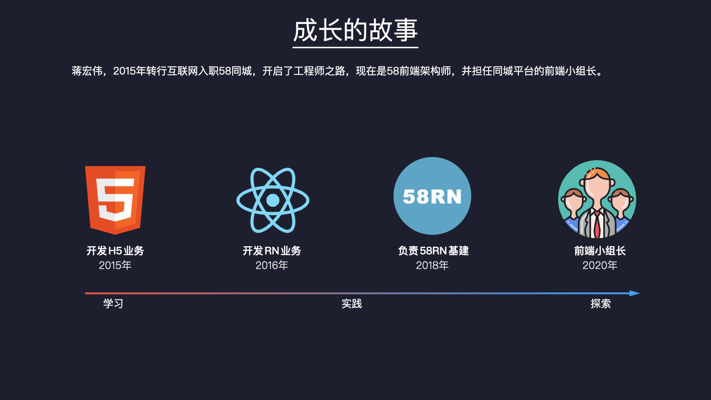

这七年无论是 H5、React Native 还是小程序等等，我都在围绕着跨端这个方向，学习、探索和实践。接下来，我想通过几个小故事和你聊一下我的心路历程。

## 过去：既做业务又做基建最幸福

我要讲的第一个故事是《学以致用的故事》。

我刚入职前几年解决的就是些小问题。这是可以预见的，你刚刚工作一两年，没有太多的积累，公司不可能一上来就让你负责一个很牛逼的项目，人都是慢慢积累的。

因此我们要先学习，把那些常见的小问题给解决好，等大家认可你的技术能力的时候，你才会有更好的机会。

我举个例子，2015 年，我学 H5 的时候，从《移动 Web 手册》这本书上学到了一个很有用的、开发移动应用的小知识。它说的是我们用的 CSS 像素（px）并不是手机屏幕中物理像素。我们都知道，一个物理像素，就是屏幕上最小的发光点，那 CSS 像素究竟和设备的物理像素有什么关系呢？

揭开这个谜团之前，我们还要了解一个非常重要的概念，叫做 DPR（Device Pixel Ratio），也就是设备像素比。现在我们的手机都是视网膜屏，大部分手机的设备像素比都是 2 或 3。

如果设备像素比等于 2 的话，那么 1 个 CSS 像素点的宽度，就是两个物理像素的宽度。既然都是物理像素了，理论上我们拿一个精度很高的尺子，就能把这个物理像素的宽度度量出来。或者查一下、量一下手机宽度，再查一下它宽度上有多个像素，也能大致估算出来。

**这样一个非常抽象的 CSS 像素，就和现实世界中的毫米给挂钩上了。**

```plain
单个物理像素宽度= 71.5 毫米/1170 物理像素 = 0.06 毫米（iPhone12）
1CSS 像素 = 3DPR * 0.06 毫米 = 0.18 毫米

```

这种把未知的抽象概念和已知具象概念挂钩的学习方案，我经常用，对提升学习效率有非常大的帮助。

但是你知道吗？你在写 React Native 的时候，React Native 的宽度 width 是没有单位的。

当时我就糊涂了，你传个数字 100 给 React Native，这个 100 到底是多宽？是 100 毫米？还是 100 的 CSS 像素的宽度？我没法把 React Native 中的单位，和我当时认知体系中的单位挂上钩。咱写代码总不能稀里糊涂写吧？总得这个最基本的概念给搞明白吧？

后来我就查资料，自己写代码验证，终于搞清楚了，原来 React Native 中的默认单位就是 Web 中的 CSS 像素。当时，我还了解到，在 Android 开发的眼中，他们把 CSS 像素叫做 dp。原来同一个东西，在不同开发者口中，还有不同的叫法，我当时也是大呼神奇。

但你要知道， **你光知道 CSS 像素、dp 和毫米的关系是没有用的，你得学以致用。**

实际上，UI 稿也有自己的像素单位，那个时候我们 UI 稿的宽度是 640 像素，这个 UI 像素既不是 CSS 像素、也不是物理像素，你还得把 UI 像素和 CSS 像素挂上钩。

那个时候，前端很流行自适应布局，UI 给的设计稿等比缩小或放大到手机、平板上。于是，我就写了一个 uipxToDp 的函数，专门用来做这种转换：

```plain
import {Dimensions} from 'react-native';

// 58 app 只有竖屏模式，所以可以只获取一次 width
const deviceWidthDp = Dimensions.get('window').width;
// UI 默认给图是 640 像素
const uiWidthPx = 640;

function uiToDp(uiElementPx) {
   return uiElementPx *  deviceWidthDp / uiWidthPx;
}

export default uipxToDp;

```

使用 uipxToDp，你可以直接使用 UI 给的像素单位先在手机上把布局弄好，然后在不同机型上 uipxToDp 函数会自动把 UI 像素转换成对应的 dp，这样就能等比例放到任意机型上了。

这就是我在刚刚入门的时候解决的一个小问题。

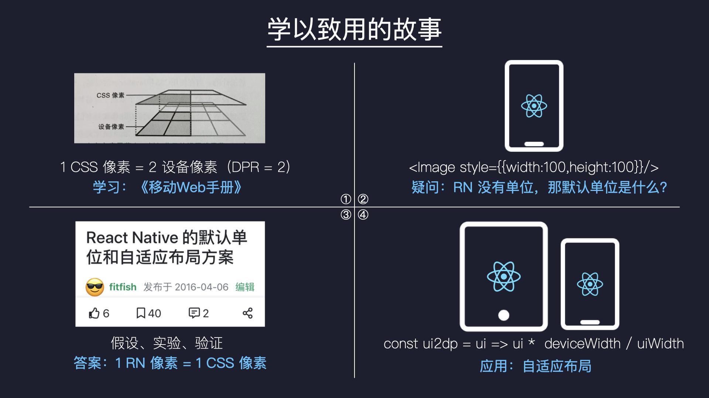

我要讲的第二个故事是《理论指导实践的故事》。

我平时除了前端技术、跨端技术，也爱了解一些最前沿的技术。当时，因为机缘巧合，参与了一个由物理学家张首晟投资的项目的白皮书翻译，后来我又读到张首晟教授在国内的一篇演讲稿。这篇演讲稿给了我很大的震撼，对我影响很大。

其中有句话是这么说的：

> 张首晟教授 ：科学有两大方向，一是把各种形态的物质，分解到最基本的组成部分；二是用这些最基本的组成部分，构造出物质不同的态。

我是这么理解的，科学搞研究是先从上往下把事物分解，再从下往上构建出一个全新的物质出来。

那我们搞技术也可以沿用这个思路。后来，我看问题的时候，就喜欢先把问题拆解、拆解、再拆解，然后再想尽办法重组、重组、再重组。我给你举个例子，比如用户打开页面的时候，他眼中的页面加载就是白屏或者转圈。

但在我眼中页面加载，是先有版本请求、资源请求，把 JavaScript 静态资源请求回来，然后Native 的 React Native 代码要初始化，下一步才是执行 JavaScript。首次执行 JavaScript 代码的时候，渲染的是一个空页面，这时候我们要先发送业务请求，在业务数据回来之后，真正的业务页面才渲染完成。

**用户的眼中，页面加载只有一步，我眼中页面加载是六步，如果需要的话我还可以细分成更多步骤。**

拆分加载页面的过程有什么用呢？是告诉用户，我们页面加载这么慢是因为它有六个步骤，你要耐心等等吗？

当然不是，用户不需要关心你的加载页面的过程是什么，他关心的是页面为什么这么慢，我们程序员不就是“用户第一”嘛，用户说慢，怎么办？我们程序员就得想办法解决，而不是给老板、给用户讲道理。

我和我的小伙伴前前后后用了 2～3 年的时间，方案也是改了又改，做了好几个优化项目，才把我们的一个耗时 2s 多的页面，降低到了 1s 以内，首屏平均耗时一共降低了 57%。并且，这个方案也是一个通用方案，任何 58RN 业务都能用。

这里我们卖个关子，理论上一个 React Native 页面的首屏渲染耗时可以控制在 100ms 以内，也就是用户点击跳转的动画还没有完成，这个页面就能渲染出来，也就是页面直出。从 1s 降低到 100ms，这也是未来 2~3 年，我们要继续做的事情。

我在入职 58 的 3~5 年之间，很多基建工作都是围绕着性能优化来做的，这件事给我的启发就是干事情， **不仅要向业内去学，还得有方法论，才能做出最贴合自己业务的方案。**

这就是我第二个《理论指导实践的故事》。

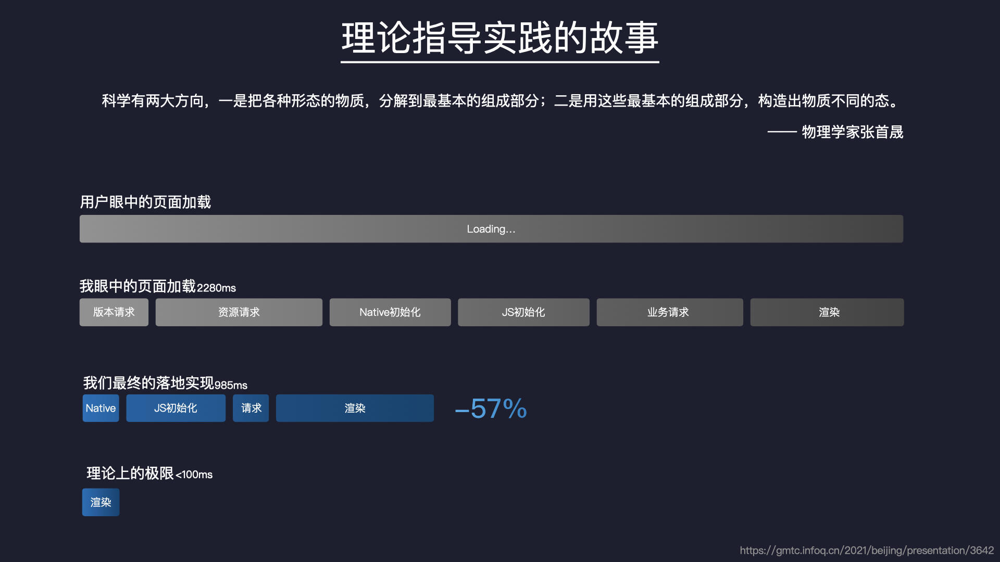

我要讲的第三个故事是《从技术深度到技术广度的故事》。我有个观点，就是“既做业务又做基建最幸福”，为什么呢？

因为你做业务的时候，你会用自己开发的产品、也能感受到产品中的问题，甚至你还能从用户、产品、老板那里收到类似反馈。这个时候，你是很容易发现业务中存在的问题的。

当初我在做 React Native 业务的时候，就花了很多时间来解决线上 BUG，有时候就是一个截图，连报错信息都没有，你说解决起来多痛苦。后来在做 58RN 基建的时候，我就在考虑要不要做一个 React Native 的监控系统。

2020 年的时候，正好有一个机会，我和我的 leader 提出要搞一个 React Native 的监控系统，他答应了。后来，我们决定先做 Web 监控，再做的 React Native 监控，因为 Web 的体量更大。

但是，当你做一个完整的大型项目的时候，“I 型”技术深度是远远不够的，你得在“I”上加一横，让你的技术能力由“I”型，变为“T”型。 **这一横，我认为就是产品能力和架构能力。**

在做这个监控系统的时候，我学起了 PM 的那套，做了各种调研，甚至我还掌握了写产品文档、画产品原型图这些技能。

产品文档、产品原型图实际就是个大体架子，架子分几层、用什么材料、搭建步骤又是什么，这些产品不会管。产品不管归谁管？架子的施工步骤归架构师管。

这时候，你还得去充当架构师的角色。你得写技术文档，画架构图，还得把这些产品、技术实现细节给小伙伴讲清楚。

后来当我参与搭建大前端监控系统的时候，就做了大量的产品和架构的活。做这些活的目的是把大家连接在一起，让大伙知道我们为什么要做，又怎么做，接着才能干好活。

当然，代码还是要写的，这一方面我重点负责的是 React Native 、ES/Duird、Node.js 部分。我记得当初完成大前端监控系统二期的时候，我还统计过一次 commit 的数量，当时我的 commit 的数量是第一的，那时候的成就感还是满满的。

搭建大前端监控系统这件事，让我从原来专精 React Native 方向的程序员，变成了一个产品、架构、前端、后端都懂一点点的全能战士。这种全能战士的能力，让我 **能站在对方角度思考问题，交流起来障碍就小，也更容易把人和人连接在一起，项目推进起来也会更有效率。**

这就是我《从技术深度到技术广度的故事》。

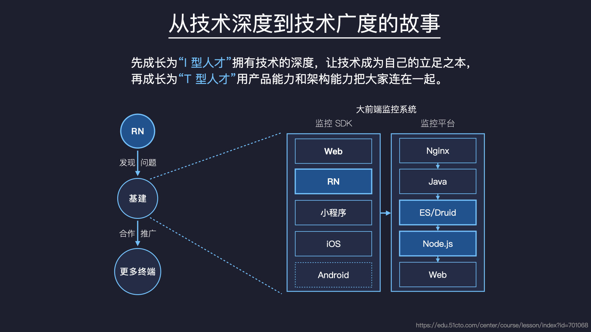

## 现在：既要与时俱进也要接地气

当然，过去的已经过去，人不能永远躺在过去的功劳簿上，还是得与时俱进跟上时代的步伐。因此，我来给你讲讲我这半年多做的探索，以及我对 React Native 新架构落地的思考，这一部分有点长，我慢慢给你展开。

**2022 年，对于 React Native 是一个大年，因为 React Native 团队官宣新架构会在今年正式发布。**

React Native 的新架构要出来了，你得升级吧？总不能让团队小伙伴，一直用老架构开发吧？我有过好几次升级经验，但每次升级牵涉面都很广，非常痛苦。

升级成本高的原因，是因为有些 React Native 业务，是同时运行在几个 App 上。只升级一个 App 还不行，需要把所有关联的 App 都同时升级，不然这些 React Native 业务要同时维护多个版本，成本也是很高的。

但 2022 年新架构出来后，即便成本很高，我也想把它升上去。因为我经过调研发现，新架构的潜在收益非常大，我认为新架构的收益是能够覆盖我们升级所付出的成本的，因此等今年新架构出来后，我会继续推进升级。

熟悉 React Native 的朋友肯定知道，2018 年之前 React Native 的核心能力是支持跨端、支持热更新，而且是背靠 JavaScript/TypeScript 生态的。

从 2018 年到现在，React Native 又推出了好几个非常吸引我的功能，主要是 2020 年 React Native 支持了 React Hooks，还有今年即将推出的 React Native 新架构。

现在 React Native 新架构的预览版已经出来了，我也第一时间进行了调研，主要有两个功能非常吸引我。 **第一个是新架构会默认使用的 Hermes 引擎，第二个是新架构的 Fabric 渲染流水线。**

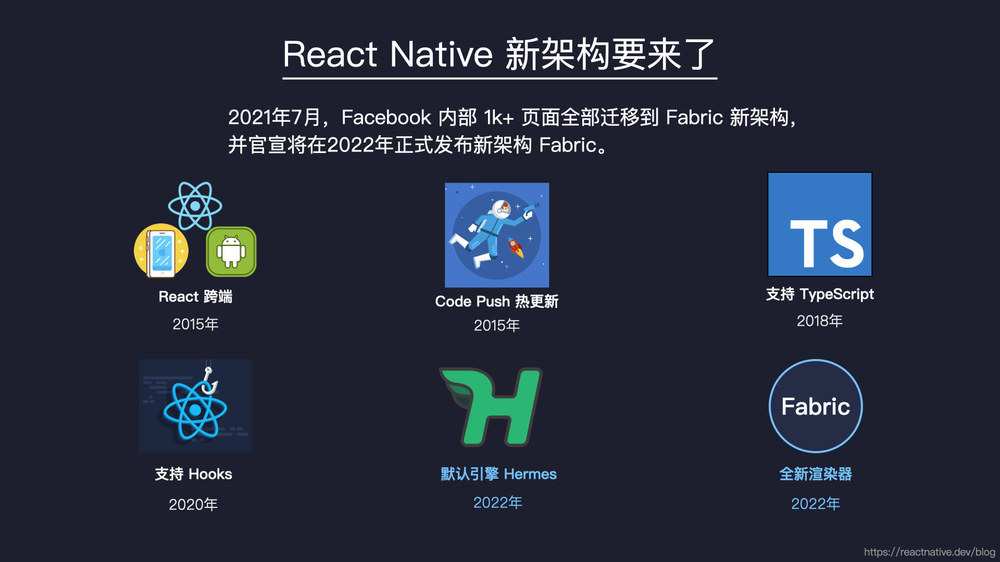

先说说 Hermes 引擎为什么吸引我。 **简单地讲，就是新架构默认集成的 Hermes 引擎性能更好。**

性能好的核心原因是，相对于 React Native 老架构采用的 JavaScript Core 引擎，Hermes 引擎是专门为移动端打造的。

在 PC 时代，我们会说电脑的性能有点过剩，但移动端时代，因为手机体积有限，性能其实是吃紧的，这个问题在一些低端机上体现得更加明显。

现在虽然我们听说的 V8 引擎、JavaScriptCore 引擎都专门为移动端做了架构升级，但由于这些引擎早在 PC 时代就诞生了，考虑很多历史限制条件，也不可能为 React Native 做专门的定制。但 Hermes 没有这些历史包袱，可以专门为移动端来定制开发。

而React Native 的老架构默认用的是 JavaScriptCore。JavaScriptCore 也叫做 JSC，它采用的是 JIT 的即时编译方案。什么叫 JIT 即时编译呢？

我用一段最简单的代码给你举个例子：

```plain
const a = 1;
console.log(a);

```

这里，你本地的 JavaScript 代码会先经过 Babel 的编译，把新语法编译为用户手机里 JavaScript 引擎支持的语法，然后下发到用户手机里去执行。

这里注意一下， **我们使用 JSC 这类 JIT 即时编译引擎，下发的依旧是 JavaScript 代码**。

但用户手机里的硬件只能执行由 0101 组成的机械码，硬件是不能直接执行 JavaScript 代码的，那怎么办呢？这时候，JSC 这类 JIT 即时编译引擎，现在主流的做法是先将 JavaScript 代码编译为字节码，然后再编译为机器码。

因为 JSC 引擎执行代码的过程是编译一段执行一段，再编译一段再执行一段，这种一边编译一边执行的方式就叫做 JIT 即时编译。

但是，在初始化时， JSC 引擎还需要把整个 JavaScript 代码都编译和执行一次。那你可能就想到了，是不是有办法先提前编译成机械码，然后把由 0101 组成的机械码下发到用户手机上，这样 JavaScript 引擎就不需要编译，只执行机器码就行了，这样 App 的初始化速度不就快了吗？

这个在本地提前把 JavaScript 代码编译为 0101 机器码的思路很好，但是由于 0101 的机械码体积很大，是 JavaScript 的 10 倍以上，那网络耗时就上去了。那么，既然提前编译为 0101 机械码不可行，我们能不能退一步编译为字节码呢？这样也能节约一部分编译时间啊。

**Hermes 引擎就是这个思路，它在本地先将 JavaScript 编译为字节码，然后再下发字节码。**

Hermes 引擎下发的字节码的体积和 JSC 引擎下发的 JavaScript 代码是一样大的，但 **Hermes 引擎执行字节码的首屏性能，却是 JSC 引擎执行 JavaScript 首屏性能的 2 倍以上。**

这就是Hermes 引擎为什么这么吸引我的原因。

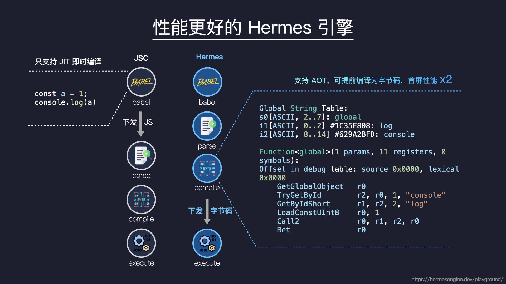

React Native 新架构第二个吸引我的原因是 Fabric 渲染器。什么是 Fabric 渲染器呢？

Fabric 渲染器中的通信层，相信你肯定很熟悉，但是通信层只是 Fabric 渲染器的一部分。很多人以为老架构升级到新架构，就是改改 JavaScript 和 C++ 之间通信的 JSBridge 就行了， **其实 JSBridge 这部分的优化在 0.62 版本，也就是 2020 年的版本中已经完成得差不多了。**

JSBridge 的作用是通过消息通知的形式，实现 JavaScript 和 C++ 之间的相互调用。消息通知形式中的消息，其实是一个字符串数组，这个字符串数组中包含了一系列的操作命令和操作参数。但字符串数组不能直接生成、也不能直接用，它有个序列化和反序列的过程，这个过程既浪费了时间、也浪费了内存。

**新架构中已经把 JSBridge 这种消息通知形式改为 JSI（JavaScript Interface）。** 有了 JSI 后，React Native 中的 JavaScript 就直接调用 C++了，就像 node.js 使用 addon 调用 C++ 、Flutter 用 FFI 调用 C++ ，以及 Java 使用 JNI 调用 C++ 一样。

但是，JSI 只是 Fabric 渲染器的一部分。如果你看过 React Native 新老版本源码的话，你会发现新架构在兼容老架构的基础上，几乎把整个底层全给重构了。

不知道你有没看过我翻译的 [React Native 架构](https://reactnative.cn/docs/architecture-overview) ，我把这篇文章也放在了 React Native 中文网上，简单说有这几点：

- 它涉及上层 React 改动，包括 Fiber 节点、Concurrent 并发模型等等；
- 上层 React Native 的 JavaScript 部分的改动，包括 nativeFabricUIManager 渲染管理器、ScrollView 组件等等的改动；
- 在 C++ 层涉及 Shadow Tree、线程模型、视图拍平等的改动和优化；
- 在 Java/OC 层面把绝大部分的 Native 组件都给重写了，而且为了兼容还保留了新老架构两套逻辑。

其中改动的细节，我们暂且不聊，我这里只想和你分享一下，Fabric 渲染器三个吸引我的点。

- 第一个点，我已经讲过了，Fabric 渲染器和新架构的 API 共用了通信层， **在 JavaScript 和 C++ 通信这一层的性能也是提升了 3 倍左右。**
- 第二个点是\*\*更容易保持跨平台一致性，毕竟 C++ 这块代码都是公用的。\*\*原来的 Shadow Tree、布局逻辑、视图拍平都是在各个平台单独实现的，现在新架构把这些用 Java/OC 代码实现的逻辑放到了 C++ 层。
- 第三个点，是 **拥有优先处理紧急任务的能力。** 新架构会集成 React18 的 Concurrent 并发模型，有些同学可能对 React18 Concurrent 并发模型有所了解，并发模型可以让优先级更高的渲染任务先执行，优先级低的渲染任务可以中断或批量渲染。

这里我们简单讲讲 Concurrent 并发模型。这有点类似我们日常处理工作，同一时刻我们一般只能处理一件事，要是同时来了几件事情怎么办？工作中我们会把事情按重要性和紧急程度分级， Concurrent 并发模型就是把渲染任务按重要性和紧急程度分级处理的策略。

对于并发模型的优化效果，我们很难拿出个数据指标说优化了 10%、20%，但从原理上，我相信是可以提高用户交互的体验的。

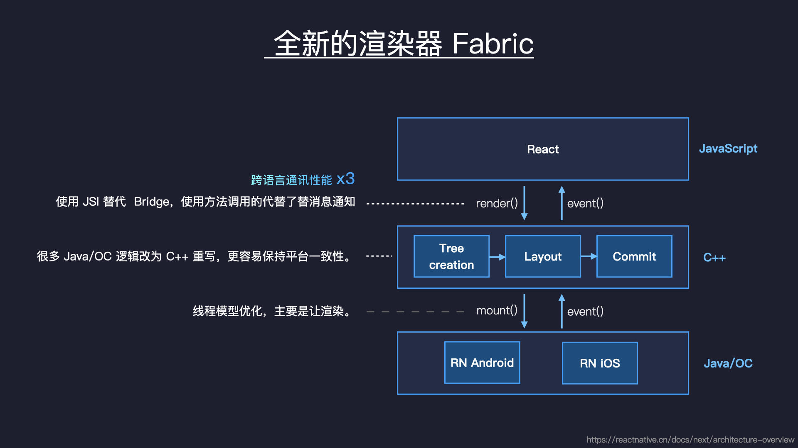

看到新架构的 Hermes 引擎和 Fabric 渲染器性能确实好，你可能想赶紧用上，但别着急。

**React Native 新架构目前还是预览版，这也意味着新架构还没有经过大规模的应用，如果贸然用到业务中去，可能会有风险。**

我们这些搞技术的人，热爱前沿技术是一件好事，但用什么技术得根据自己业务的实际情况来。换句话说，我们既要与时俱进，也要接地气，不能飘着，这样才更容易推动技术落地。

技术要想落地至少分为三步，首先得确定收益，对业务没有收益的事情就不考虑了。其次是确定成本和风险，最关键的控制风险，新技术线上出了大规模故障我们是要担责任的。无论通过业务试点、灰度、降级，还是其他别的方案，我们要把风险控制好，新技术才能进入大规模应用阶段。

但任何技术内部的技术点都是存在生命周期的，这就像生物体内的细胞存在新陈代谢一样，新的技术点会慢慢地替代老的技术点，而老的技术点会被慢慢淘汰。

我在和用到 Hermes 的同学聊的时候，他们的反馈都很不错，告诉我线上很稳定，而且对低端机的长列表性能有提升。可以预见的是， Hermes 这个技术点，会慢慢把 JSC 淘汰掉。

而 Fabric 这个技术点，还处于技术生命周期中的预研期，目前看来收益不错，接下来就是想办法排除风险，然后大规模应用。

关于 React Native 新架构这件事情， **我的判断是 React Native 新架构在未来 1~2 年会得到大规模应用。** 为什么要 1~2 年这么长的时间呢？一方面，现在新架构还是预览版，正式版可能会在今年下半年发；另外一方面，大规模应用要排除风险，排除风险也是需要一段时间的。

那这新架构普及的 1~2 年的时间差对个人的意义在哪呢？

我认为，一个技术人越是走在业内前面，你就越是能把握住技术红利，而这对于个人成长和职级晋升都是有好处的，因此这 1~2 年的时间就是你研究新架构的最好时间。

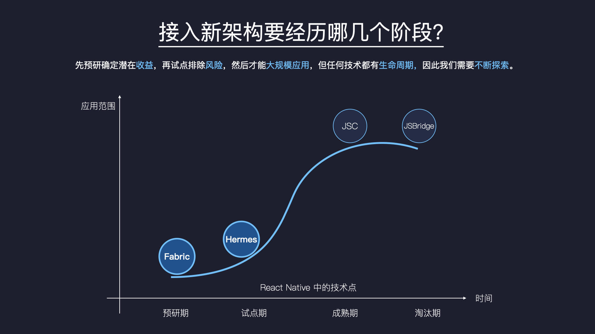

## 未来：前进，探索未知的新大陆

像 React Native 新架构在 1~2 年内得到大规模应用这种事情还是比较好预测的，但我还想看到更远的未来。比如：

- 未来 2~3 年像 React Native 这类新架构会是怎么样的？
- **在更遥远的未来，比如 5~10 年后，手机没有性能问题了，H5 会不会替代跨端技术？**
- 如果跨端技术未来都不存在了，那我死磕跨端技术是不是浪费了青春？

对待这些问题，我内心是恐惧又兴奋，恐惧的是未来的不确定性，兴奋的是我可能问到了跨端技术的本质，恐惧和兴奋同时驱使着我去寻找这些问题的答案。

我的解题思路是这样的：

- 未来是未知的，但过去是已知，我可以从历史经验中寻找答案；
- 历史上的跨端技术的终局是什么样的？又是哪些因素导致了当前的跨端格局的形成？
- 那未来这些因素还会不会继续存在？如果这些因素还会继续存在，那么跨端技术是不是会继续存在？如果不存在跨端技术又会被什么技术代替？

我们先来看历史。

我们当前所处的时代还是移动互联网时代，我们现在所聊的跨端技术，大都指的是跨 Android、iOS 两端。历史上对类似“跨端”的技术，有个更通用的叫法，叫做跨平台（Cross Platform）。

**任何跨平台、跨端软件的共性都是屏蔽底层差异，抽象统一接口，减少开发者的适配成本。** 而跨平台中的平台二字，通常指的是硬件平台和软件平台，软件平台又包括操作系统平台和软件程序环境。

硬件平台中最重要的是 CPU，你可能知道目前 CPU 分为两个派系，一个是 ARM 精简指令集，另一个是 X86 复杂指令集，而且每个派系之间还有不同的硬件生产商，有 Intel、AMD、高通、苹果、华为等等。

操作系统是跨硬件平台的。操作系统平台是运行在硬件平台之上，电脑上常用的操作系统包括，Windows、macOS、Linux，手机上就是 Android、iOS。操作系统中有一类特殊的程序，叫驱动程序，驱动程序是硬件厂商根据操作系统编写的配置文件，可以说，没有驱动程序，计算机中的硬件就无法工作。类似的还有苹果的 macOS 操作系统，它也通过 Rosetta 屏蔽了 ARM 和 X86 的差异。

无论是操作系统提供的驱动程序适配，还是类似 Rosetta 二进制编译器，都是操作系统为跨硬件平台所做的努力。

程序执行环境是跨操作系统平台的。在操作系统之上直接创建的应用，我们叫做原生应用。原生应用只能在一个平台运行，比如 Android 应用只能运行在 Android 操作系统上。但哪个开发者不想省事啊？历史上 Java 提过“Write once, Run anywhere”，还有服务端同学熟悉的 Docker 镜像，以及前端同学熟悉的 Chrome 浏览器，都是类似的思想。

Java、Docker、Chrome、跨端框架都是在操作系统之上的程序环境 ，它们会屏蔽不同操作系统之间的差异性，并向开发者提供了统一的抽象接口，让开发者可以只写一次代码，并运行在多个操作系统之上。

**历史的经验告诉我们，无论是硬件平台、操作系统平台、还是程序环境平台，没有哪个平台是一家独大、独霸整个市场的。同一个维度的平台之间，没有赢家通吃的垄断，只有少数几个寡头之间的竞争，寡头竞争的格局产生了跨平台的需求。**

从历史和行业视角来看，无论是能源、汽车、金融、软件和现在的互联网行业，都是从原子式的竞争格局走向寡头竞争的格局的。因此，我认为无论未来的商业格局怎么变化，未来的操作系统、未来的程序环境也不会一家独大。

所以跨端、跨平台的不是伪命题。只要还存在多个寡头并存的平台竞争格局，跨端的需求就会一直存在。认识到这点之后，我对跨端技术未来的担忧也就消失了。

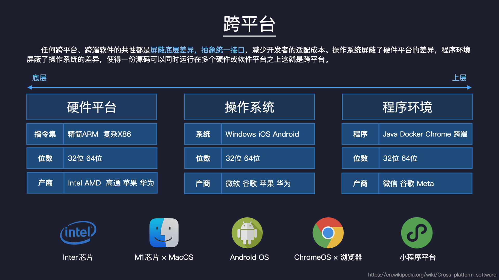

虽然跨端方向是一个很好的技术方向，但跨端的技术很多，有小程序、Flutter、React Native、H5/Hybrid，具体到每个技术上又有细分。一个人的精力是有限的，多嚼不烂，我应该选择那个方向重点研究呢？

目前我自己规划的重点研究方向是 React Native SSR。为什么我最终决定选择 React Native SSR 作为重点研究方向呢？有三个原因：

**1、“Native SSR” 的市场很大。**

目前绝大多数的 Native 应用采用的还是客户端渲染 CSR 方案，没有成熟的服务端渲染 SSR 方案。

不过我们也能看到，在 Native 应用中，大厂都有自研自己的 [布局动态化、逻辑动态化](https://juejin.cn/post/7046299455397560350) 的方案，说明这块的需求还是很强的。Native 服务端渲染的 “SSR ” 方案主要的优势在于，业务可以随时上线、可减少包体积，还有跨端优势。

比如我们58同城推出的 Flutter 模板动态化方案 [Fair](https://github.com/wuba/fair) 、字节跳动的 Android/iOS 跨端动态化方案 [Lynx](https://github.com/hxxft/lynx-native) ，还有美团的 Flutter 跨端动态化方案 [Flap](https://tech.meituan.com/2020/06/23/meituan-flutter-flap.html) ，Airbnb 的 [Server-driven rendering](https://medium.com/airbnb-engineering/whats-next-for-mobile-at-airbnb-5e71618576ab) 方案等。

但是各家都是自造轮子，市面上并没有出现一个得到大规模应用的 SSR 框架，说明这类动态化技术方案还处于早期探索阶段。

**2、目前看来，“Native SSR” 要成还得依赖 JavaScript 生态。**

为什么这么说呢？因为目前的 Native 应用中用的大部分是 CSR 渲染。虽然也有服务端下发 DSL 渲染静态页面的解决方案，但处理复杂的业务逻辑上，DSL 完全不够。

DSL 是什么呢？比如 HTML、JSON 这种非图灵完备的语言就是 DSL，非图灵完备就决定了，它只能解决特定领域的问题，不能解决普适性的问题，复杂业务更是没法处理。

而且，由于苹果公司的政策，只有特定的 JavaScript 程序才能够动态更新，因此能够同时满足跨端、图灵完备和动态更新的特点的语言只有 JavaScript。

但现有的 “Native SSR” 也有采用 JavaScript 方案的呀，为什么没有大规模应用呢？因为现有的 “Native SSR” 还要解决第二个问题，也就是同构问题。

Web SSR 也是解决了同构问题之后才大规模铺开的，也就是一套代码既可以在本地跑起来，又可以在服务端跑起来。即使 SSR 方案在服务端扛不住了，还有 CSR 方案在客户端帮忙兜底，开发 SSR 的适配成本很低，这才能流行起来。

如果你要是让开发者，在Android 写一套代码，在iOS 写一套代码，SSR 写一套代码，CSR 又写另一套代码，开发者就会说，“你这方案再牛逼，我也不想用”，成本太高了。

**3、“Native SSR” 借助 React Native将有机会得到大规模应用。**

首先你可能会问，为什么 “Native SSR” 得借助 React Native 来实现呢？

在大规模应用 “Native SSR” 必须使用 JavaScript 方案和解决同构问题的双重前提下，目前我能想到的只有 React Native 了。但光有 React Native 还不够，还得有个 React Native 版的服务端渲染框架，类似于 Web 中 Next.js。

目前 Web SSR 的方案大致是，开发者先在本地实现一个 React 应用，然后把本地实现的 React 程序跑在 node.js 服务端上，要跑在服务端就得借助 Next.js 框架了。Next.js 把服务端渲染、路由方案都给配置好了，我们的 React 程序直接拿来用就行了。

然后 Next.js 框架执行 React 程序代码生成 HTML，HTML 下发到浏览器就能把 Web 页面首屏直接渲染出来了。

那同样的，React Native 要大规模实现 SSR，就得造一个 Next.js 的轮子。让 React Native 能同时在本地和服务端运行起来。首先开发者在本地，能通过 “类 Next.js” 的框架使用客户端渲染 CSR 的方式，开发 React Native 应用，然后在服务端能通过服务端渲染 SSR 的方式，执行 React Native 代码，输出一个序列化 Tree。这个序列化的 Tree 描述的就是 React Native 的静态布局结构。

接着服务端把序列化的 Tree 下发到 iOS/Android 应用上，Native 应用对 Tree 进行反序列化后，直接通过 C++ 层的 [Fabric 渲染器](https://reactnative.cn/docs/render-pipeline) ，执行布局、提交和挂载操作，生成 Native 页面。

这就是借助 React Native 实现 “Native SSR” 的基本原理。

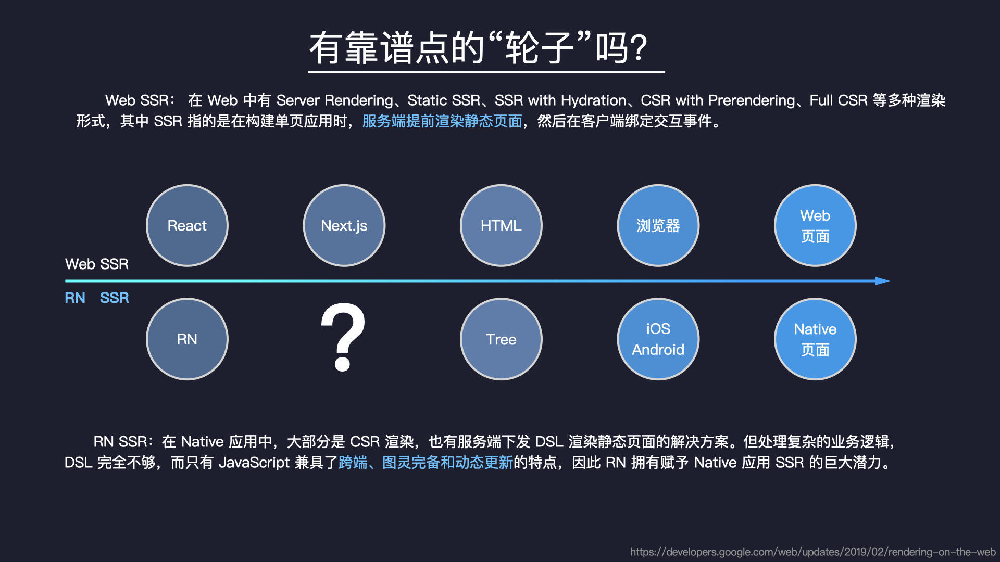

有些小伙伴可能会问，原来的 React Native 不是有热更新吗？热更新不是也可以实现动态化吗？

那 React Native 的热更新和 React Native SSR 有什么区别呢？

React Native 热更新的本质还是客户端渲染 CSR 方案，首屏渲染速度要比服务端渲染 SSR 方案慢上不少。根据我的性能优化经验，一个复杂的 React Native 应用，采用热更新方案渲染耗时在 2000ms 左右，如果做到极限可能在 700ms 左右。当然，一般达不到极限，因为越是极限，要满足的条件越苛刻，业务的应用范围越小。

CSR 渲染的渲染步骤分为 6 步：

1. 请求服务端获取最新的 Bundle 资源地址；
2. 通过返回的资源地址，下载 Bundle 资源，也就是 JavaScript 代码；
3. 初始化 JavaScript 引擎和 Native 模块；
4. 执行 JavaScript 代码，生成空页面；
5. 与此同时发起业务请求，请求最新的业务数据；
6. 业务数据回来后重新渲染，生成最终的页面。

SSR 渲染其实是对 CSR 渲染的步骤的重组，整体也是 6 步：

1. 并行请求 Tree，和最新的 Bundle 资源地址；
2. 初始化 Native 模块，同时开启后台线程并行请求 Bundle 资源；
3. 使用 Tree 文件，通过 Fabric 渲染器渲染首屏页面。这里画个重点，此时用户已经可以看到业务页面了；
4. 然后再初始化 JavaScript 引擎，开始执行 JavaScript 代码；
5. 这一步有个专有名词叫做 Hyration。大致的意思原来通过 Tree 生成的页面是不可交互的“静态”页面，这时需要通过执行 JavaScript，生成一个有交互的“动态”页面，把原来的“静态”页面替换掉；
6. 替换后的页面，就是可以交互“动态”页面了。

使用 SSR 配合预请求，理论上实现 100ms 以内的首屏渲染是没有问题的。比如，美团就实现了 [React Native SSR](https://ppt.infoq.cn/slide/show?cid=94&pid=3696)，据说页面渲染最快可以达到 50ms 。

当然，要大规模应用，一方面要依赖 React Native 团队提供更友好的接口，另一方面还得有类似 Next.js 的框架，来大幅降低开发者的适配成本。

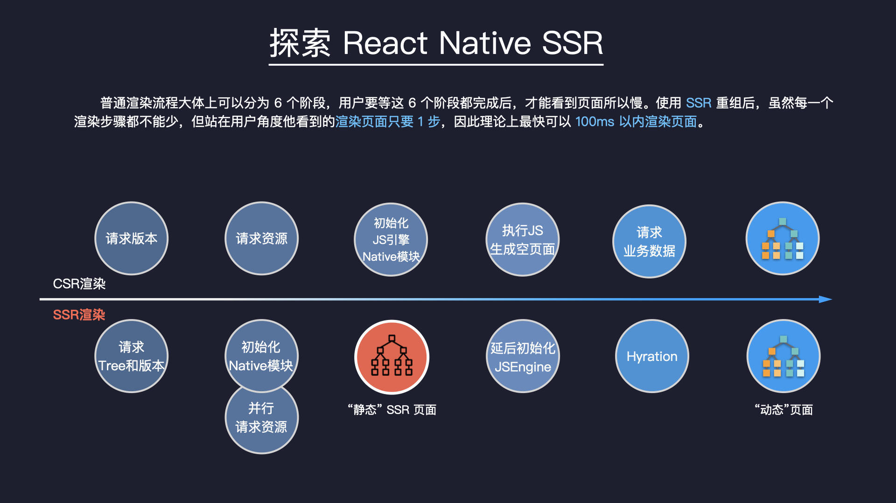

好了，这就是我跨端的故事，希望我过往经验和观点能对你的工作有所帮助。